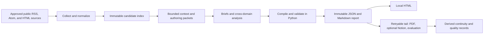

# SignalTrail Architecture

**Purpose:** Define canonical system boundaries, dependency direction, state ownership, and artifact authority.
**Status:** Verified
**Owner:** Repository maintainers
**Last verified:** 2026-08-25
**Scope:** Canonical implementation in `src/daily_intelligence/`

This document is the top-level map of domains, dependencies, state ownership, and
artifact authority. Detailed operating policy remains in `references/`.

Chinese translation: [docs/zh-CN/ARCHITECTURE.md](docs/zh-CN/ARCHITECTURE.md).

## System Boundary



The model selects, summarizes, and analyzes only bounded evidence. Python owns identity,
state transitions, revision allocation, evidence hydration, validation, persistence, and
publication checkpoints. External content is data and never an instruction source.

Model-host receipts cross a separate local usage-audit boundary. That boundary accepts only
allowlisted counts, timings, costs, short labels, and hashed lineage. Prompts, responses, hidden
reasoning, tool arguments, opaque host IDs, credentials, and raw session logs must remain outside
the authoritative usage store.

## Design Principles

- Local-first: versioned JSON/Markdown survive projection or network failure.
- Deterministic shell: code owns state and validation; model output is an untrusted draft.
- Explicit degradation: partial access remains visible and recoverable.
- Bounded context: collection volume does not linearly expand authoring context.
- One dependency direction: lower layers never depend on CLI arguments or remote publication.
- Backward-compatible reads: legacy nested source items remain accepted and synchronized.
- Retryable edges: browser verification, PDF, Notion, and evaluation cannot revoke local truth.
- Observable uncertainty: an unavailable token, call, duration, or cost value is unknown, not zero.

See [docs/design-docs/core-beliefs.md](docs/design-docs/core-beliefs.md) for the
decision rules behind these principles.

## Layers and Ownership

| Layer | Modules | Owns |
| --- | --- | --- |
| Foundation | `utils`, `storage`, `models`, `access`, `localization`, `taxonomy`, `runtime` | Types, paths, atomic I/O, access semantics, shared utilities |
| Usage audit | `llm_usage` | Immutable task/call/usage events, host normalization, deduplication, lineage hashes, unknown-preserving summaries |
| Configuration | `config` | Source portfolio, runtime options, path-independent validation |
| Acquisition | `adapters`, `feeds`, `prefetch`, `collector`, `clustering` | Fetching, normalization, source status, zero-token clustering |
| Evidence | `content`, `media`, `image_policy`, `monitor` | Full text, images, monitor snapshots, evidence lineage |
| Context | `semantics`, `state`, `context`, `authoring` | Stable/run-relative semantic split, continuity, bounded packets, immutable repair receipts |
| Evaluation and budget | `evaluation`, `llm_budget` | Hash-bound evaluator dossiers, unknown-aware phase reserves and dispatch decisions |
| Report | `reporting`, `reports` | Compilation, schema/cross-field validation, immutable records |
| Projection | `local_output`, `notion`, `dashboard` | HTML/PDF/Notion and read-only monitor views |
| Orchestration | `workflow` | Run state machine, deadlines, recovery, retryable tail |
| Entry points | `cli`, `usage_cli`, `verification`, `importer` | Command parsing, usage hooks/import, explicit human verification, legacy import |

The intended dependency direction is Foundation → Configuration → Acquisition → Evidence
→ Context → Report → Projection → Orchestration → Entry points. A high layer may call a
lower layer; the inverse requires an explicit architectural reason and tests.

Usage audit is a cross-cutting local sidecar rooted in Foundation. Host adapters feed it without
depending on report or publishing layers; Orchestration records references to its tasks, while
Entry points expose local start, hook, import, summary, and finalize operations.

## Primary Flows

### Monitor

```text
feeds + static HTML -> access classification -> normalized items
-> lexical clusters -> snapshot + source health + feed cache
```

The monitor performs no model calls. A failed monitor refresh never blocks formal collection.
Time-sensitive tests inject a clock; they do not depend on the wall-clock date.

### Edition

```text
prepare run -> collect index -> build bounded context -> enrich selected evidence
-> accept independent brief batches -> build compact analysis packet
-> assemble draft -> compile/validate -> save immutable report -> deliver local HTML
-> retry PDF/Notion/evaluation tail
```

Batch authoring can only read its assigned packet and listed evidence. Brief and analysis packets
carry receiver-enforced JSON Schemas for every nested field/type/enum and deny undeclared or
Python-owned fields. The final analysis task reads the compact dossier, not the full collection.
Validation must report zero errors before the draft can become a report revision.

Semantic cache stores only content-stable translated titles and TL;DR text. Each run recomputes
importance and status from the current index, date, evidence availability, and prior-report flag;
cache metrics explain every reuse or rejection. The three analysis domains use stable identities
(`ANALYSIS-GEOPOLITICS`, `ANALYSIS-AI_TECHNOLOGY`, and `ANALYSIS-MARKETS`). Legacy active rows are
preserved as superseded history and their orphaned watch signals are explicitly closed.

Before brief, analysis, repair, or evaluation dispatch, the budget layer reads bound immutable
usage summaries and reserves downstream capacity. Rejected brief/analysis drafts create
content-hashed immutable field/rule receipts and authorize at most one repair. The evaluation
tail preflights current completion, reconciles the one-shot scheduler, permits no more than two
total attempts, and gives the independent Agent a minimal immutable report/index-hash dossier.

### LLM Usage Audit

```text
start usage task -> bind task in run.llm_usage.tasks[]
-> Hermes hook | Codex rollout JSONL | OpenClaw agent SQLite / legacy JSONL
-> allowlist normalization + hashed lineage -> immutable usage events
-> deduplicated unknown-preserving summary -> immutable task finalization
```

Hermes foreground hooks are the primary per-request evidence. Codex cumulative snapshots are
converted to nonnegative per-session deltas. OpenClaw's current per-agent SQLite is opened
read-only and accepted only at audited schema v17; legacy JSONL remains an explicit compatibility
path. The adapters never make a model call and never recursively preserve a raw receipt.
`reasoning_output` and `tool_call_output` are diagnostic
subsets of output rather than additional total-token components; cache inclusion semantics are
explicit. Missing host fields remain `unobservable` with `null` values.

## State Ownership

`RunStatus` in `workflow.py` is authoritative:

```text
created -> collecting -> building_context -> awaiting_selection
-> extracting_content -> awaiting_authoring -> finalizing
-> completed | completed_partial | failed
```

Foreground completion means the local report exists. `completed_partial` records missing
sources or an exhausted budget; it is not a synonym for failure. Tail state is nested and
independently retryable: `pending -> running -> completed | partial`.

`run.llm_usage` is the authoritative run-to-metering index. It declares
`authority: immutable_usage_events` and binds each attempt to one or more verified usage task IDs,
host adapters, phases, and local event directories. These entries are references, not copied token
totals: `usage/.../events/*.json` remains authoritative, and conflicting bindings for one task ID
are rejected.

Source and content statuses are explicit enums in `models.py`. Never infer `no_items` from an
exception, HTTP denial, rate limit, or verification page.

## Artifact Authority

| Artifact | Mutability | Authority |
| --- | --- | --- |
| `indexes/...-rN.json` | New revision only | Collected candidate/evidence identity |
| `content/.../<retrieval>.md` | Append by retrieval | Extracted evidence record |
| `context/...-rN*.json` | Bound to run/session hash | Authoring input contract |
| `reports/...-rN.json` | Immutable | Canonical structured report |
| `reports/...-rN.md` | Immutable | Canonical reviewable report |
| HTML/PDF | Rebuildable | Reading projection |
| Notion | Retryable remote copy | Never a factual input |
| `runs/...json` | Atomic mutable manifest | Workflow checkpoint and usage-task bindings, not token authority |
| `usage/YYYY-MM-DD/<task>/events/*.json` | Immutable event append | Authoritative LLM task/call usage, timing, cost, quality, and hashed lineage |
| `state/*.json` | Atomic derived state | Continuity cache, rebuildable from records |
| `evaluations/dossiers/<report-id>.json` | Immutable | Minimal hash-bound independent-evaluation input |

Atomic writers use a unique sibling file and a per-target lock. Immutable JSON creation uses
an atomic no-overwrite link so concurrent writers cannot claim the same revision. On Windows,
same-directory replacement retries only transient access/share/lock conflicts with bounded
backoff; unrelated errors and exhausted retries still fail visibly.
Finalized usage summaries are immutable derived views over those events. Exact zero is retained
when a host reports zero; absent evidence remains `null`/`unobservable` and is never summed as zero.
Per-task process and OS locks serialize append/finalize, completed finalization rejects open calls,
and every read revalidates path identity, deterministic event/payload hashes, allowlisted shape,
and the finalized summary. These hashes detect accidental or unsynchronized tampering; they are
not HMAC signatures against an attacker who can rewrite the full local ledger.
PDF-bound images are resampled to a fixed print envelope, and projection receipts expose render
seconds, output bytes, and a configurable soft size budget. PDF remains a retryable projection:
budget excess is a warning, and evaluation refresh reuses the same-revision file byte-for-byte.

## Compatibility and Release Copies

Root `items[]` is the canonical index model. `sources[].items[]` remains a synchronized legacy
view. Schemas 1.1–1.5 remain readable; new reports use schema 2.0 and require
`cross_perspective_synthesis`.

Edit root `src/`, `configs/`, `schemas/`, `templates/`, and `references/`. The checked-in
`skills/signaltrail/` tree and generated `dist/`/`build/` directories are not implementation
sources. Package output is built from an explicit Git-tracked allowlist by
`scripts/build_hermes_skill.py`.

## Verification Map

| Boundary | Primary tests |
| --- | --- |
| Source configuration and legacy import | `test_config.py`, `test_normalize.py`, `test_importer.py` |
| Feeds, monitor, and clustering | `test_feeds.py`, `test_monitor.py`, `test_clustering.py` |
| Evidence and media | `test_content.py`, `test_media.py`, `test_desktop_delivery.py` |
| Context, authoring, evaluation, and budget | `test_authoring.py`, `test_semantics.py`, `test_evaluation.py`, `test_llm_budget.py` |
| LLM usage, host adapters, and run binding | `test_llm_usage.py`, `test_usage_cli.py`, `test_architecture.py` |
| Schema, state, recovery, publication | `test_reporting.py`, `test_architecture.py`, `tests/skills/` |
| Packaging and documentation | `test_hermes_package.py`, `test_docs.py` |

For detailed recovery and editorial policy, follow the catalog in
[docs/README.md](docs/README.md).
