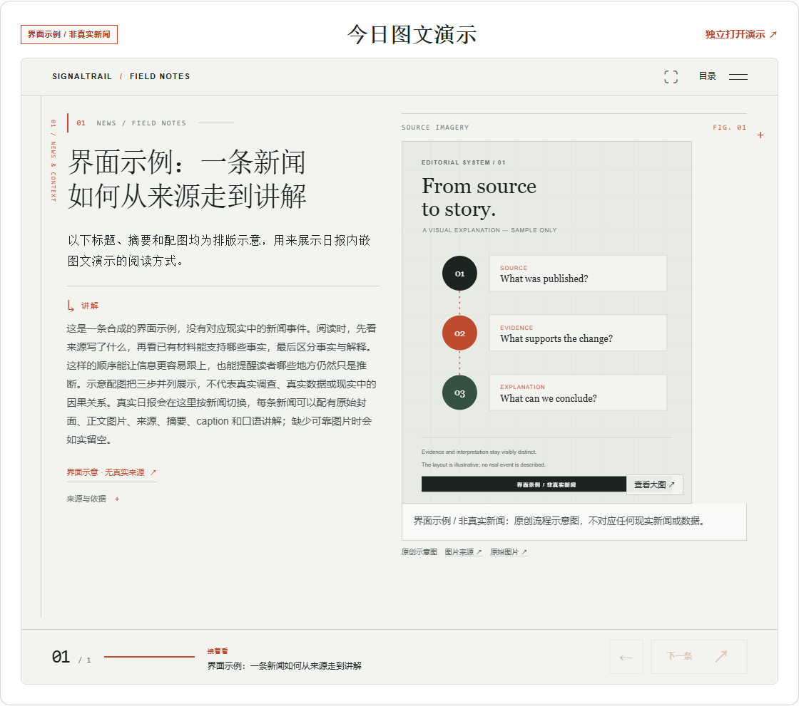

# SignalTrail

[简体中文](README.md) | [English](README.en.md)

SignalTrail is a local news workflow. It collects material from configured public sources, creates source-linked Chinese or English daily reports, and can turn a report into a navigable, animated HTML presentation. Reports can also be read as HTML, exported to PDF, or optionally sent to Notion.

Python handles collection, evidence and state, validation, and versioned storage. An agent writes from bounded evidence packets. Slide narration uses a conversational, rhythmic presenter voice with light humor, and selects geopolitics, AI/technology, or markets perspectives only when relevant to the story. Chinese narration is 200–350 non-whitespace characters per story. There is no issue-wide cap on representative stories; work is split into batches with per-batch cost gates.

[Quick start](#quick-start) · [Animated HTML slides](#animated-html-slides) · [Local monitor](#local-monitor) · [Documentation](docs/README.md) · [Development](docs/development.md)

## What you can do

- **Create daily reports:** collect public sources, write summaries and analysis, save versioned JSON and Markdown, and render local HTML and PDF. The reader works on desktop and mobile.
- **Browse a local news stream:** refresh RSS/Atom and configured static pages, cluster related stories, and inspect source health. Monitor refresh and clustering make no model calls.
- **Build illustrated presentations:** select representative stories from a saved report, write narration in bounded batches, and render a standalone animated HTML deck. When available, the deck is also embedded in the report with a separate open link.
- **Explore related work:** optional experimental explainers and parallel research are documented separately. They are not part of the stable daily news narration workflow.

## Animated HTML slides



The image is a synthetic interface example, not a real news story.

Each story occupies one slide. The presenter-style narration appears with the daily summary, sources, and available cover and article images. The gallery prefers clearer image variants, keeps extracted publisher captions, and supports thumbnails, an expanded view, 100% original-size inspection, and a link to the original image. It displays collected material only: images and captions are never invented, and stories without usable images remain without one.

Slides can be navigated inside the report's “Today’s visual briefing” panel or opened as a standalone HTML page. Local templates render the layout and transitions without additional model calls. Text-to-speech and video generation are not implemented.

Representative stories are selected from report highlights and high-importance briefs by default, with no fixed issue-wide cap. A batch contains up to four stories by default and has estimated input and output token limits; larger editions continue in more batches. These are batch-size gates, not price quotes or guarantees of host-reported usage. Chinese narration is validated at 200–350 non-whitespace characters. Analysis perspectives are included only when supported by the story evidence.

Start with a saved report and its matching index:

```sh
signaltrail slides prepare --report REPORT.json --index INDEX.json
```

Have the agent write each prepared batch to a JSON file, then submit the results, check progress, and render:

```sh
signaltrail slides submit --packet PACKET.json --input DRAFT.json
signaltrail slides status --plan PLAN.json
signaltrail slides render --plan PLAN.json
```

After all batches are ready, `render` creates the deck HTML and updates the matching report page with its embedded presentation. See the [news slides guide](docs/news-slides.md) for the full packet, budget, and recovery workflow.

## Quick start

You need Python 3.11+ and an agent host with a configured model; Git is needed when cloning the source. You can clone the repository or download the [SignalTrail 2.1.0 full install package](https://github.com/Merak-Wang/signaltrail-skill/releases/latest).

```sh
git clone https://github.com/Merak-Wang/signaltrail-skill.git
cd signaltrail-skill
python -m pip install -e .
signaltrail --help
```

Load the repository root [`SKILL.md`](SKILL.md) in your agent, then ask for a report, for example:

```text
Use SignalTrail to create today's English morning report as local HTML and PDF.
```

`signaltrail` is the unified CLI. The Python package can be imported as `signaltrail` or launched with `python -m signaltrail.cli`. The CLI prepares reproducible collection, validation, and storage steps; the agent writes from the evidence packets. Running `run-edition` alone stops at the authoring handoff and does not produce a complete report by itself.

### Install for Hermes

Run the matching installer from the repository or extracted full-package root:

```powershell
# Windows
powershell -NoProfile -ExecutionPolicy Bypass -File .\scripts\install.ps1
```

```sh
# macOS / Linux
bash ./scripts/install.sh
```

The scripts synchronize the Skill to Hermes and install the Python command. Browser collection on Windows can use system Microsoft Edge. The macOS/Linux installer also installs Playwright Chromium in the same Python environment. For a manual install, run:

```sh
python -m playwright install chromium
```

When upgrading from the earlier package, uninstall the old `daily-intelligence-skill` Python distribution before installing `signaltrail-skill`. Stop active runs, then rename the old Hermes data and dedicated browser-profile directories to `signaltrail`; renaming keeps all saved report history. See [Upgrade from an earlier version](docs/usage.md#upgrade-from-an-earlier-version) for exact paths and commands.

See the [usage guide](docs/usage.md) for host setup, data directories, metered runs, and recovery.

## Local monitor

```sh
signaltrail refresh-monitor
signaltrail serve --open --refresh-minutes 30
```

The monitor refreshes sources, organizes the news stream, and clusters related stories without model calls. The server listens on `127.0.0.1` by default and stops refreshing when the process exits. Configure report sources in [`configs/sources.yaml`](configs/sources.yaml) and monitor discovery sources in [`configs/discovery-sources.yaml`](configs/discovery-sources.yaml).

## Data, cost, and boundaries

Versioned report JSON and Markdown are the original records; HTML and PDF are rebuildable reading views. Existing report revisions are not overwritten. Source access failures, rate limits, and verification challenges retain their actual status. Runtime data stays local in the Hermes `signaltrail/` directory by default. Existing users can rename the old data directory as described in [Upgrade from an earlier version](docs/usage.md#upgrade-from-an-earlier-version), preserving reports and run history.

Collection, monitoring, image handling, and HTML rendering make no model calls. The agent host performs report and slide writing. Batch token gates limit estimated input and output size; actual usage depends on what the host reports. Source availability, network access, evidence coverage, and model latency affect delivery and coverage.

Slides are a separate HTML projection and do not change the report's JSON or Markdown. Speech and video are not currently available. See the [documentation index](docs/README.md) and [roadmap](docs/roadmap.md) for the boundary between experimental explainers/research and the stable report and slides workflow.

## Documentation

- [Usage](docs/usage.md): installation, host, runs, data directory, and recovery.
- [News slides](docs/news-slides.md): narration, images, captions, batch budgets, and rendering.
- [Experimental explainers](docs/explainers.md) and [parallel research](docs/research/2026-09-20-illustrated-workflow.md): experimental workflows and admission limits.
- [Architecture](ARCHITECTURE.md), [development guide](docs/development.md), and [known issues](docs/exec-plans/tech-debt-tracker.md): design and maintenance.
- [Changelog](CHANGELOG.md) · [MIT License](LICENSE)

Earlier report screenshots show the historical reader design, not the current slide presentation:

<details>
<summary>Historical report example and reader screenshots</summary>

[Open a historical HTML example](https://github.com/Merak-Wang/signaltrail-skill/raw/refs/heads/main/examples/reports/2026-08-25-morning-r1.html) in a browser (some images require internet access). See the [example notes](https://github.com/Merak-Wang/signaltrail-skill/blob/v2.1.0/examples/README.en.md).


</details>

[简体中文](README.md)
