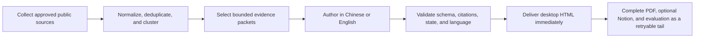

# SignalTrail

[简体中文](README.md) | [English](README.en.md)

> Signals distilled. Sources intact.

SignalTrail is a local-first editorial-reporting skill and CLI for agent harnesses.
Any harness that can read `SKILL.md`, run local commands, consume self-contained
authoring packets, and return structured JSON can drive the core pipeline. SignalTrail
collects approved public sources, clusters duplicate coverage, and uses the selected
harness to produce a Chinese or English briefing with visible evidence, explicit
source health, and continuity across editions.

The repository provides Hermes conveniences for installation, request hooks,
delegation, and independent-evaluation scheduling, plus built-in model-usage adapters
for Codex and OpenClaw. Other harnesses can orchestrate the common CLI/packet protocol
and add their own hook or `UsageAdapter`; usage remains explicitly `unmetered` until
exact metering is connected.

[Inside a report](#inside-a-report) · [Report gallery](#report-gallery) · [Quick start](#quick-start) ·
[Engineering records](docs/README.md) ·
[Skill procedure](SKILL.md)

[](SKILL.md)
[](https://hermes-agent.nousresearch.com/)
[](LICENSE)


## Inside a report

Schema 2.0 puts the full collection view, selected evidence, analysis, and quality
boundaries into one searchable report:

- The source index preserves every brief's original title, URL, time, access state,
  and source order. The editorial layer then selects 6–10 evidence events without
  pretending that the full collection contains only a handful of items.
- Geopolitics, AI/technology, and markets each receive a four-to-seven-paragraph
  reader narrative with expandable argument and evidence. Cross-perspective synthesis
  states shared conclusions, key disagreements, transmission chains, and watch signals.
- Independent evaluation is bound to the immutable report content hash and exposes
  nine dimension scores, evidence gaps, and acceptance boundaries. Search, the
  collapsible table of contents, portable desktop HTML, and responsive mobile reading
  all use the same report revision.

| Cross-perspective synthesis | Independent quality evaluation |
| --- | --- |
|  |  |

<p align="center">
  
</p>
<p align="center"><sub>The same report remains searchable, navigable, and readable in a 390 px viewport.</sub></p>

## What the product delivers

SignalTrail turns a large daily reading queue into a consistent decision artifact:

- **Reader-ready morning and evening reports** in HTML and PDF, with Markdown and
  JSON retained as durable local records.
- **A harness-independent core**. Python owns collection, state, validation, and
  projection; self-contained packets ask the host only for bounded semantic writing
  and can run concurrently or serially when the host has a lower worker limit.
- **Traceable coverage** that keeps the original title, source, link, publication
  time, and any access limitation visible beside the summary.
- **A seven-section editorial view** spanning international, domestic, military,
  markets, technology, research papers, and open-source projects.
- **Three analytical lenses plus synthesis** for geopolitics, AI/technology, and
  markets, including shared signals, disagreements, and what to watch next.
- **A zero-model-token local monitor** for feed refresh, caching, deduplication,
  clustering, and source-health review. Model work begins only for report selection,
  target-language writing, and analysis.
- **Bounded generation with rejection receipts**. Briefs and analysis must satisfy
  structured constraints; an invalid submission gets at most one budget-gated repair,
  with a hash-bound receipt that excludes the draft body.
- **Auditable model usage** stored as immutable, allowlisted counts by run and phase.
  Missing coverage remains `unknown` or `unmetered`; an exact token baseline requires
  exact observations.
- **Local ownership by default** with versioned files, a portable desktop HTML copy,
  and optional Notion delivery.

The bundled configuration separates 32 core reporting sources from 51 discovery
sources. Every formal source has `report_target: 15` and `report_max: 15`: when at
least fifteen candidates exist, the report uses the first fifteen in the current
index order; otherwise it uses the candidates actually available. Discovery sources
keep both values at zero, broadening the signal surface without silently expanding
the editorial or model budget.

A full run can require up to 480 ordinary briefs. SignalTrail limits authoring to
the planned Top-15 gaps, splits them into at most 12 bounded packets, and processes
them in host-sized waves with at most three workers by default. Harnesses with lower
concurrency can process packets serially; Hermes' three-child default matches this cap. A
60-minute hard budget stops dispatching new stages after the limit. The current release makes no
delivery-SLA commitment. When delivery must land exactly at 06:00 or 18:00, start earlier and leave margin
for provider latency, access verification, and bounded retries.

## Report gallery

The current gallery first preserves hundreds of searchable briefs as a full collection
view, then selects a small evidence set for analysis. “Complete coverage” and
“editorial selection” are deliberately separate layers.

| Current schema 2.0 edition | Full collection view | Selection and analysis | Independent evaluation |
| --- | ---: | ---: | --- |
| [2026-08-25 morning r1](https://github.com/Merak-Wang/signaltrail-skill/blob/main/examples/reports/2026-08-25-morning-r1.html) | 30/32 formal sources produced output · 424 briefs | 8 evidence events · 3 domain analyses · 1 cross-perspective synthesis | 37/45 |

This is a historical run snapshot. Its independent evaluation accepted the current
quality boundary while disclosing that most items had metadata-level evidence and
that some WATCH items were stale or lacked publication times. The full run took
3,974 seconds, above the 3,600-second hard budget, so this edition serves as a product
showcase only. The HTML contains no credentials or local runtime paths, but its 136 images
use public-source URLs; full viewing requires a network connection, and those external
images may disappear or change.

The preserved compatibility editions below use schema 1.5 and the earlier
**Daily Intelligence** masthead:

| Historical edition | Coverage processed | Editorial result | Decision themes |
| --- | ---: | ---: | --- |
| [2026-07-24 morning r3](https://github.com/Merak-Wang/signaltrail-skill/blob/main/examples/reports/2026-07-24-morning-r3.html) | 24 sources · 197 updates | 10 priority events | Energy, tariffs, and AI capital efficiency |
| [2026-07-25 morning r1](https://github.com/Merak-Wang/signaltrail-skill/blob/main/examples/reports/2026-07-25-morning-r1.html) | 29 sources · 235 updates | 10 priority events | Energy corridors, technology regulation, and agent engineering |

GitHub may display the HTML source; download the file and open it locally for the full
report experience.

Fixture data and gallery notes are documented in
[examples/README.en.md](https://github.com/Merak-Wang/signaltrail-skill/blob/main/examples/README.en.md).

## Roadmap

The next stage focuses on verifiable news explanation. Every item below is Draft or
planned work and remains unavailable in the current release:

- **Evidence-driven scripts** will turn a completed report and index into a bounded
  narrative packet that connects selected news, context, counterevidence, and
  multi-perspective analysis in chapter form.
- **Independent beat verification** will bind every claim or beat to current report
  evidence and a content hash. Failed verification, stale evidence, or a revision
  mismatch will keep the script out of reader and media stages.
- **A deterministic story stream** will arrange verified beats, citations, licensed
  images, and explicit fallback media into a reproducible explanatory sequence.
- **Speech, subtitles, and news-explainer video** will follow the story-stream gate,
  with licensed TTS, measured subtitle timing, reproducible rendering, technical QA,
  content-consistency checks, and media-rights review.
- **Multi-harness execution and acceptance** will keep the common packet protocol while
  requiring three consecutive morning/evening editions to pass frozen token, evidence,
  quality, and freshness thresholds before release.

These projections consume a verified immutable report and cannot alter or revoke the
delivered JSON, Markdown, HTML, or PDF. The detailed boundaries live in the
[draft architecture](docs/design-docs/evidence-driven-professional-narrative-report.md),
[product specification](docs/product-specs/evidence-driven-professional-narrative-report.md),
and [active execution plan](docs/exec-plans/active-evidence-driven-professional-narrative.md).

## Product fit

SignalTrail is designed for individual researchers and small teams that use an agent
harness—or directly orchestrate the local CLI—and want a repeatable report they can
inspect, archive, and modify locally.
It is especially useful when “why this item is here” and “what failed to load” matter
as much as the summary.

The current scope excludes paid research, social-firehose coverage, mobile clients,
SSO, RBAC, and delivery SLAs. SignalTrail also respects login, CAPTCHA, paywall, rate-limit,
and other access controls.

| Need | SignalTrail approach |
| --- | --- |
| Daily executive readout | Fixed morning/evening structure with concise editorial selection |
| Evidence review | Original source identity, title, URL, time, and status remain visible |
| Ongoing situational awareness | Local monitor, story clusters, source health, and verification queue |
| Bilingual delivery | One selected output language across content, interface, PDF, and Markdown |
| Durable ownership | Local JSON/Markdown source of truth; rebuildable HTML/PDF projections |
| Remote handoff | Optional Notion metadata page with a portable HTML attachment |

## Quick start

### Requirements

- Git and Python 3.11 or newer
- An agent harness that can read `SKILL.md`, run local commands, and let workers return
  structured JSON; hosts without child-task concurrency can process packets serially
- Microsoft Edge on Windows or Playwright Chromium on macOS and Linux
- A configured [Hermes Agent](https://hermes-agent.nousresearch.com/) and Hermes
  Gateway only when using the Hermes quick-install path

### Connect any harness

The core Python package has no Hermes dependency. Clone the repository, install the
CLI, and let the selected harness load the root `SKILL.md`:

```text
git clone https://github.com/Merak-Wang/signaltrail-skill.git
cd signaltrail-skill
python -m pip install -e .
daily-intel --help
```

Across harnesses, `--data-dir` or `DAILY_INTEL_DATA_DIR` binds one canonical data
root. When the CLI starts outside the repository, `DAILY_INTEL_SKILL_DIR` can point to
the directory containing `SKILL.md`, `configs/`, and `schemas/`. The host uses its own
delegation mechanism for `brief_authoring_batches` and the analysis packet. Hermes,
Codex, and OpenClaw have built-in usage adapters; another host can extend
`UsageAdapter` or retain explicit `unmetered` coverage. Automatic independent
evaluation currently uses Hermes Cron. Other hosts can schedule the same hash-bound
dossier; without a scheduler, the corresponding tail remains partial.

### Hermes quick install

These scripts install the Python package and synchronize the skill to Hermes at
`skills/research/signaltrail`.

Windows:

```powershell
git clone https://github.com/Merak-Wang/signaltrail-skill.git
cd signaltrail-skill
powershell -NoProfile -ExecutionPolicy Bypass -File .\scripts\install.ps1
```

macOS or Linux:

```bash
git clone https://github.com/Merak-Wang/signaltrail-skill.git
cd signaltrail-skill
bash ./scripts/install.sh
```

On a new Ubuntu or Debian machine, install the Chromium system libraries after the
script completes:

```bash
python -m playwright install-deps chromium
```

The backward-compatible `daily-intel` command remains available after installation:

```text
daily-intel --help
```

Upgrading does not rename or split the established
`$HERMES_HOME/daily-intelligence` data root. Resource discovery also accepts the
legacy `skills/research/merak-brief` and `skills/research/daily-intelligence`
locations. After confirming the new `/signaltrail` skill works, remove the old
skill directories if Hermes shows legacy brand entries.

### Ask the selected harness for the first report

These prompts work in any harness that has loaded the skill and can be sent directly
to Hermes:

```text
Use SignalTrail to create today's Chinese morning report as local HTML and PDF.
```

Or:

```text
Use SignalTrail to create an English evening brief, highlight what changed today,
and add tomorrow's watch signals.
```

The default output language is `zh-CN`. Select English per run:

```text
daily-intel run-edition --edition morning --language en
```

Or set the long-term choice in `configs/sources.yaml`:

```yaml
output:
  language: zh-CN  # zh-CN or en
```

The selected language controls summaries, analysis, labels, HTML, PDF, and Markdown.
Original headlines remain unchanged; a translated title is added only when needed.

## How it works



Collection failures do not stop healthy sources. A failed, rate-limited, or
verification-pending source keeps that status and its recovery path; it is never
silently converted to `no_items`. If the index contains candidates but brief
authoring or validation did not finish, the report names every affected source and
its validated/planned count even when sibling sources in that section succeeded; it
must not describe those candidates as uncollected or let the source vanish silently.

Before dispatching a brief, analysis, repair, or evaluation stage, the budget gate
rebuilds the observed lower bound from immutable usage events and adds versioned
downstream reserves. Crossing the limit stops new stages while preserving completed
indexes, drafts, and report artifacts. Semantic cache reuse is also limited to titles
and summaries whose content fingerprint, language, and independent-evaluation state
still match and whose item remains inside the current source plan; an old item outside
the Top 15 cannot be used to fill a coverage gap.

## Local intelligence desk

Refresh and inspect the monitor:

```text
daily-intel refresh-monitor
daily-intel monitor-status
```

Open the localhost desk and refresh while the process is running:

```text
daily-intel serve --open --refresh-minutes 30
```

The desk listens on `127.0.0.1` by default. Installation does not register a system
service; unattended refresh requires the process to remain running or an
OS-level scheduled task.

Edit the source portfolio directly:

- Core report sources: [configs/sources.yaml](configs/sources.yaml)
- Discovery sources: [configs/discovery-sources.yaml](configs/discovery-sources.yaml)

All sources share `collection.item_order`. The default `source` mode gives a formal
source its original page, ranking, or feed Top1–15. In `published_at` mode, the
formal report takes the first fifteen from the current index after valid publication
times are sorted newest first; missing and tied times retain stable input order. A
source-level `item_order` can override the global value. Both modes preserve the
original `source_rank`, and ordinary briefs are not reordered by `importance`.
Hugging Face Papers uses the Trending list, so `source` mode follows its current Top
ranking even when it contains papers published in earlier years.

## Output contract

| Artifact | Role |
| --- | --- |
| `reports/YYYY-MM-DD/EDITION-rN.json` | Versioned structured record; existing revisions are never overwritten |
| `reports/YYYY-MM-DD/EDITION-rN.md` | Reviewable and diff-friendly archive |
| `reports/YYYY-MM-DD/EDITION-rN.html` | Full local reading edition |
| `reports/YYYY-MM-DD/EDITION-rN.pdf` | Print/share edition; images are resampled to print bounds, with duration, byte size, and the default 50 MiB soft budget recorded |
| `reports/index.html` | Local archive by date and revision |
| `Desktop/daily-intelligence-…html` | Portable single-file reading copy with images embedded |
| `evaluations/dossiers/REPORT_ID.json` | Read-only independent-evaluation input bound to report and index hashes |
| `usage/YYYY-MM-DD/TASK_ID/events/*.json` | Immutable model-usage audit events with no prompt or generated body |
| Notion | Optional metadata page plus portable HTML attachment |

Across harnesses, `--data-dir` or `DAILY_INTEL_DATA_DIR` selects the canonical local
data root, with report history under its `reports/` directory. For compatibility with
existing deployments, the Hermes quick-install path continues to use
`%LOCALAPPDATA%\hermes\daily-intelligence` on Windows or
`~/.hermes/daily-intelligence` on macOS and Linux. A configured `HERMES_HOME` retains
the `daily-intelligence/` child directory.

Notion is optional. Without Notion credentials, every local artifact remains
available. If desktop delivery, PDF rendering, or Notion delivery fails, the
versioned local record remains intact and the failed projection can be retried.

## Agent Skill and Hermes community package

Compatible Agent Skills harnesses can consume the public root metadata and procedure
in `SKILL.md`. Hermes discovery and configuration live under `metadata.hermes`. The
repository also includes an allowlisted builder that produces a separate
`dist/signaltrail` directory for Hermes community distribution and checks metadata,
runtime files, package size, and common secret patterns. Maintainer requirements and
verification entry points are cataloged under Packaging in [AGENTS.md](AGENTS.md).

## Documentation

- Repository map: [AGENTS.md](AGENTS.md)
- Architecture: [ARCHITECTURE.md](ARCHITECTURE.md)
- Engineering record catalog: [docs/README.md](docs/README.md)
- Skill procedure: [SKILL.md](SKILL.md)
- Operations and recovery: [references/runbook.md](references/runbook.md)
- Editorial and evidence policy:
  [references/editorial-policy.md](references/editorial-policy.md)
- Detailed architecture and state model:
  [references/system-design.md](references/system-design.md)
- Model-usage audit and host integration:
  [references/llm-usage.md](references/llm-usage.md)
- Hermes quick setup on Windows:
  [references/windows-setup.md](references/windows-setup.md)
- Notion setup: [references/notion-setup.md](references/notion-setup.md)
- Release history: [CHANGELOG.md](CHANGELOG.md)

## Contributing

Engineering boundaries, documentation synchronization, and the full validation gate
are maintained in [AGENTS.md](AGENTS.md) and the
[engineering record catalog](docs/README.md). CI checks tests, static analysis,
compilation, and documentation consistency. Runtime `data/`, browser profiles,
cookies, account screenshots, authenticated HTML, and secrets remain outside version
control.

## License

[MIT](LICENSE) © Wang Mingfeng
