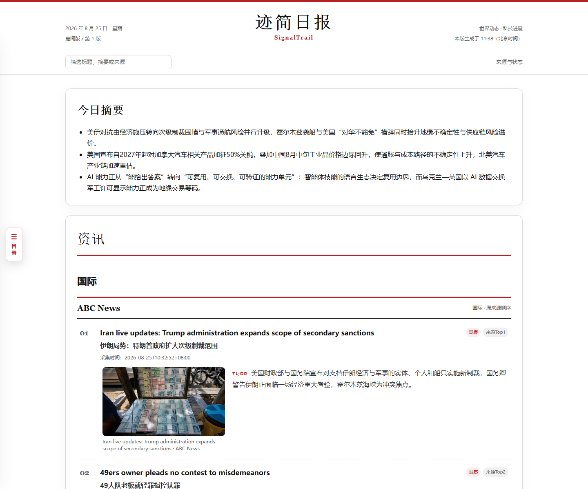
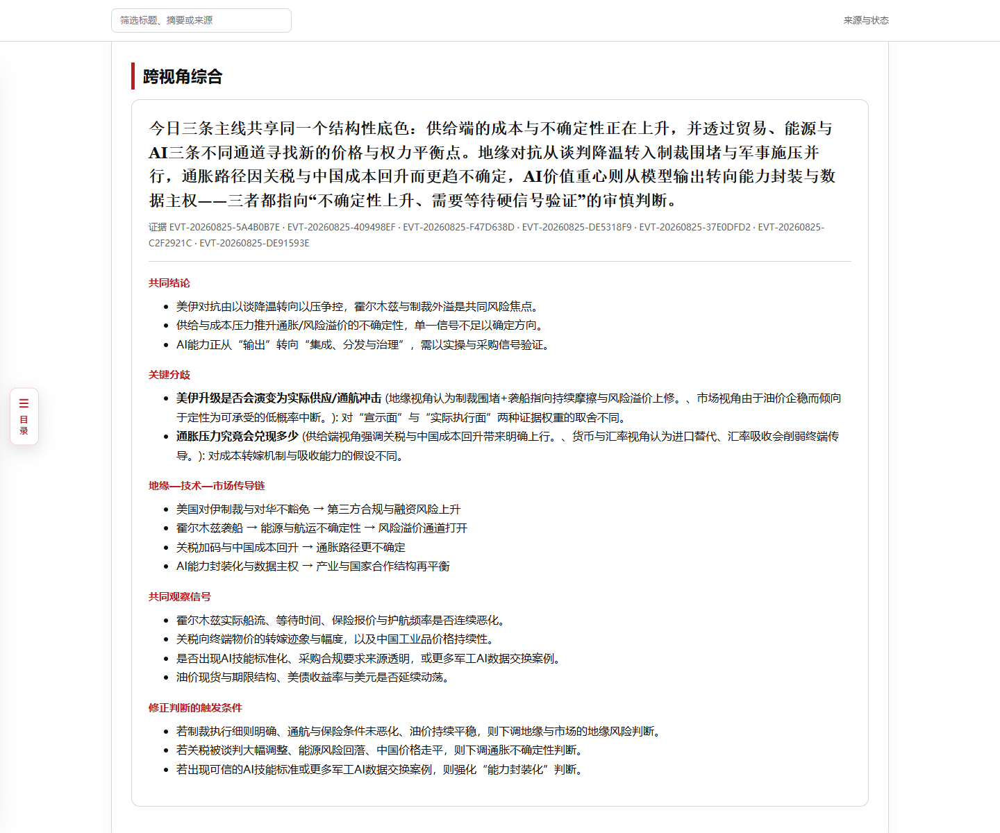
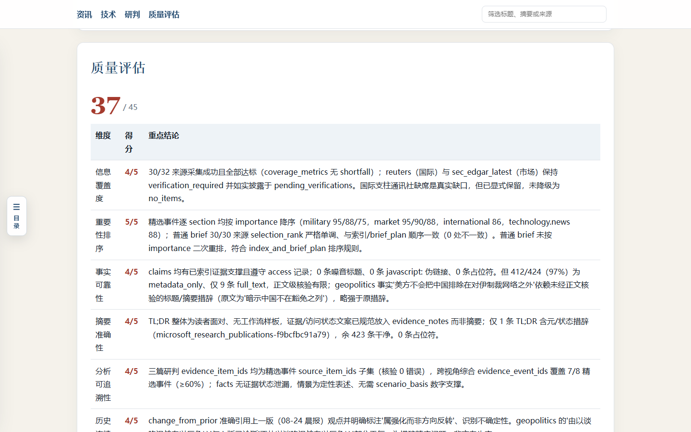
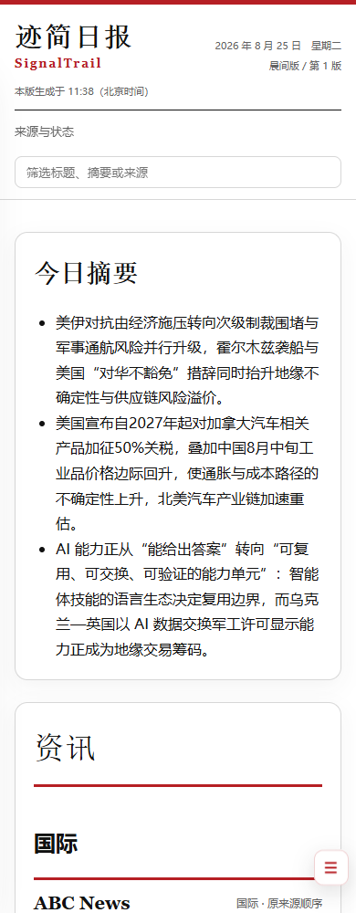

# 迹简情报台 · SignalTrail

[简体中文](README.md) | [English](README.en.md)

SignalTrail 从你配置的公开来源收集新闻，生成带原文链接的中文或英文晨报、晚报。
报告保存在本地，可用 HTML 阅读、PDF 分享，也可选同步到 Notion。

它由一个 Python CLI 和一份 [Skill](SKILL.md) 组成：Python 负责采集、去重、校验和存档，
智能体负责阅读证据、撰写摘要和分析。Hermes 提供安装和计量接入；其他能执行本地命令、
读写 JSON 文件的智能体也可以使用。

[快速开始](#快速开始) · [使用说明](docs/zh-CN/usage.md) ·
[开发指南](docs/zh-CN/development.md) · [文档](docs/zh-CN/README.md)



## 报告示例

一份报告包括按来源排列的新闻摘要、精选事件，以及地缘政治、AI / 技术和市场三个视角的分析。
跨视角综合连接这些分析；独立评估列出评分和证据缺口。每条新闻保留原题、链接、时间和访问状态。

[下载示例 HTML](https://github.com/Merak-Wang/signaltrail-skill/raw/refs/heads/main/examples/reports/2026-08-25-morning-r1.html)
即可打开阅读。该历史示例有 424 条摘要、8 个精选事件，独立评分 37/45；
30/32 个来源有输出，完整运行约 66 分钟，超过一小时预算。部分证据只有标题和摘要，
配图来自公共 URL，需要联网。更多说明见[示例目录](https://github.com/Merak-Wang/signaltrail-skill/blob/main/examples/README.md)。

<details>
<summary>查看分析、质量评估和移动端截图</summary>





</details>

## 快速开始

需要 Git、Python 3.11+，以及一个已配置模型的智能体环境。

```sh
git clone https://github.com/Merak-Wang/signaltrail-skill.git
cd signaltrail-skill
python -m pip install -e .
signaltrail --help
```

在智能体中加载仓库根目录的 `SKILL.md`，然后告诉它：

```text
使用 SignalTrail 生成今天的中文晨报，保存为本地 HTML 和 PDF。
```

`signaltrail` 和旧命令 `daily-intel` 使用同一入口。CLI 提供各个确定性步骤；
完整报告需要智能体完成写作和提交，单独运行 `run-edition` 会停在等待写作的阶段。

Hermes 用户可以在仓库目录运行安装脚本：

```powershell
# Windows
powershell -NoProfile -ExecutionPolicy Bypass -File .\scripts\install.ps1
```

```sh
# macOS / Linux
bash ./scripts/install.sh
```

脚本会安装 Python 包并同步 Skill。浏览器依赖、数据目录、输出语言和完整计量运行见
[使用说明](docs/zh-CN/usage.md)。

## 本地监控

监控刷新、去重和聚类不调用模型。启动后可在本机浏览新闻、来源状态和待验证页面：

```sh
signaltrail refresh-monitor
signaltrail serve --open --refresh-minutes 30
```

服务默认监听 `127.0.0.1`，关闭进程后停止刷新。
正式报告来源在 [sources.yaml](configs/sources.yaml)，发现来源在
[discovery-sources.yaml](configs/discovery-sources.yaml)。内置 32 个正式来源和 51 个发现来源；
每个正式来源最多写入 15 条摘要，发现来源只用于监控。

## 数据与限制

JSON 和 Markdown 是版本化原始记录；HTML、PDF 和 Notion 是阅读副本。
已有报告修订不会被覆盖。网络失败、限流和待人工验证都会保留各自状态，缺失用量也不会记作零。
运行数据默认留在本机，目录与恢复方法见[使用说明](docs/zh-CN/usage.md)。

来源可用性、模型速度和证据完整度会影响交付。配置中的一小时预算是停止派发新工作的上限，
不保证所有来源、PDF 和评估都能在一小时内完成。[已知问题](docs/zh-CN/exec-plans/tech-debt-tracker.md)
记录当前限制。

新闻讲解稿、逐段核验、语音和视频仍在计划中，尚未提供；范围见[路线图](docs/zh-CN/roadmap.md)。

## 开发

从[开发指南](docs/zh-CN/development.md)开始；系统边界见
[架构](docs/zh-CN/ARCHITECTURE.md)，智能体修改仓库时读取 [AGENTS.md](AGENTS.md)。
版本变化记录在 [CHANGELOG.md](CHANGELOG.md)。

[MIT License](LICENSE) © Wang Mingfeng
