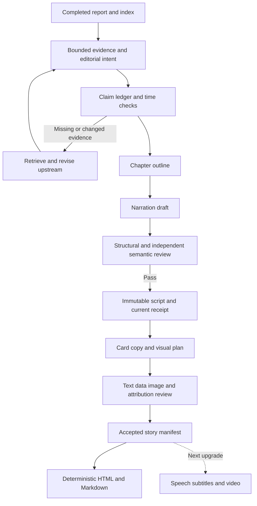

# News explainers and story streams: workflow and prompt research

**Status:** Historical — research completed before the experimental runtime implementation
**Owner:** Repository maintainers
**Last verified:** 2026-09-08
**Purpose:** Choose a source-backed path from SignalTrail news evidence to narration and an illustrated reading stream.
**Audience:** Readers of Chinese and English with some background; Chinese oral storytelling and English novel-like narrative, retaining professional analysis (confirmed by the user).

[中文](../zh-CN/research/2026-09-08-news-explainer-workflows.md) · [Implementation roadmap](../roadmap.md) · [Experimental prompts](../../templates/news-explainer-prompts.md)

This record preserves the research-time proposals. The current experimental implementation and remaining gates are documented in [the explainer guide](../explainers.md).

## Recommendation

Introduce an independently revisioned news explainer built from a completed report's selected
evidence and analysis. Organize it around what the reader needs to understand, write a natural
narration, then adapt it into an ordered illustrated reading stream. This upgrade ends at local
HTML/Markdown reading. Speech, subtitles, and video belong to the next upgrade.

The proposed workflow is **editorial intent → evidence and time ledger → resolve gaps or narrow
scope → outline → narration → independent factual review → card copy and visual planning →
card review → deterministic rendering**. Any new wording creates content needing review; the
renderer consumes accepted text, data, and assets. This is an engineering synthesis for this
repository, not a tested optimal prompt or a demonstrated production accuracy result.

Storytelling should use questions, sequence, explanation, and transitions. Unreported actions,
dialogue, thoughts, motives, and endings cannot be filled in by a model. Nieman's scene-writing
guidance grounds scenes in observation, reporting, or recordings; when SignalTrail has only
announcements and summaries, timelines and mechanisms are more suitable than invented scenes.
[Lauren Kessler, Nieman Storyboard, 2023-04-20](https://niemanstoryboard.org/2023/04/20/narrative-journalism-reporting-writing-scenes/)

## Existing implementation and gaps

This assessment uses current code, contracts, and behavior tests rather than the older local plan.

| Capability | Current evidence | Implication |
| --- | --- | --- |
| Bounded authoring and strict output shape | `context.py`, `authoring.py`; schema, evidence-boundary, and one-repair tests | Reuse the pattern; new packets still need immutable bindings |
| Three analysis domains and synthesis | Schema 2.0, report contract, `references/narrative-analysis.md` | Reuse admitted analysis; do not send all briefs back to another writer |
| Narrative with supporting reasoning | `context.py`'s `narrative_contract`, four to seven paragraphs | Existing narrative analysis is not yet a separately verified explainer |
| News-time constraints | Fresh candidate selection and publication/collection distinction | Does not verify new temporal assertions in generated prose |
| Independent report evaluation | `evaluation.py`, immutable dossier tests | Useful foundation; not pre-release, per-claim script admission |
| Images and vertical reading | `media.py`, HTML/Markdown/Notion projection tests | Existing news images are not an ordered explanatory story manifest |
| `verification.py` | Browser challenge completion and collection recovery | Access verification; factual script review needs a separate responsibility |

Current analysis evidence must come from featured events. Each schema-2.0 featured event has
exactly one source article. Do not merge several related articles into that existing field or
admit brief-only evidence by bypassing selection. New evidence follows collection, indexing,
selection, and report revision before entering a narrative packet. See the
[report contract](../../templates/report-contract.md) and [architecture](../../ARCHITECTURE.md).

## Editorial methods worth adapting

| Source and date | Transferable method | Limit |
| --- | --- | --- |
| [BBC radio/podcast writing](https://downloads.bbc.co.uk/academy/academyfiles/Making%20news%20for%20radio%20or%20a%20podcast.pdf), BBC Academy, undated | Write for one hearing; use plain speech and read the draft aloud | Does not establish an ideal Chinese sentence length or speaking rate |
| [Ros Atkins explainer seminar](https://reutersinstitute.politics.ox.ac.uk/calendar/art-viral-news-explainer), Reuters Institute, event 2022-01-26, Marina Adami | Explain relevance, control density, craft transitions, review fairness | His stated approach is fact-focused; SignalTrail must explicitly distinguish its added analysis |
| [GIJN storytelling advice](https://gijn.org/stories/tips-for-writing-investigative-stories/), Olga Simanovych, 2018-11-19, reporting Ilya Lozovsky's methods | One-sentence focus, selective detail, identities, and signposting | Investigative chronology should not bury the newest fact in breaking news |
| [Narrative Podcasts script process](https://narrativepodcasts.com/how-do-i-write-a-podcast-script), institutional byline, undated | Separate drafting, editing, reading aloud, and listener feedback | Practitioner teaching with course marketing; unfinished news need not have a character arc or resolution |
| [The Pudding's process](https://pudding.cool/process/pivot-continue-down/), Amber Thomas, 2020-08 | Start with an answerable question, storyboard it, pivot or stop when evidence fails | Editorial experience, not proof of engagement gains; broad legal claims in the article are not adopted |
| [BBC writing across platforms](https://downloads.bbc.co.uk/academy/youngreporter/Lesson%20Plans%20-%20Lesson%20Five%20-%20Transcript%20English.pdf), BBC Academy, undated | Adapt material to the medium and decide what visuals explain | No validated card count, dimensions, or copy length |

Reuters Institute's 2024 audience research distinguishes receiving updates from learning and
understanding perspectives. This supports a separate explainer use case, but its self-reported,
cross-market findings do not replace testing with this product's Chinese- and English-reading audiences.
[Richard Fletcher, 2024-06-17](https://reutersinstitute.politics.ox.ac.uk/digital-news-report/2024/more-just-facts-how-news-audiences-think-about-user-needs)

### What social discussion adds

An accessible Reddit podcasting discussion contains both full-script and outline approaches.
Some contributors use a script for concise solo narration and practice conversational delivery;
the original poster reports extra writing time and a less natural result. These are anecdotes,
not authenticated expertise or controlled effect estimates. Votes are not evidence of quality.
[r/podcasting discussion](https://www.reddit.com/r/podcasting/comments/1dmxgmc/do_you_type_or_write_out_what_you_are_going_to/)
(search date 2024-06-23; the opened page gives a relative date).

The proposed product choice is to retain complete scripts for traceability and revise their
spoken style. Treat full-script versus outline delivery as an experiment, without admitting
improvised facts. Bilibili creator interviews were searched, but sufficiently complete first-party
method descriptions were not obtained. This research does not cover current WeChat, Xiaohongshu,
Douyin, or X distribution algorithms systematically.

## Adding explanation to analysis

### Shared evidence, language-specific narration

Author each language from the same claim and analysis ledger rather than translating sentence
by sentence. Compare entities, quantities, times, attribution, causality, scenario conditions,
and certainty. Keep separate language-tagged script and card revisions; do not mix languages
inside the existing single-language report schema.

| Language | Proposed voice | Editorial moves |
| --- | --- | --- |
| Chinese | Professional explanation with oral storytelling rhythm | Open a concrete question, supply preceding context, explain the turn, return to the main thread |
| English | Journalistic nonfiction with novel-like continuity | Sourced details, temporal progression, varied paragraph rhythm, narrative woven with exposition |

Novel-like is a style preference. Use people or scenes when reported; announcements and data
can support an event- or mechanism-led narrative. English reading prose can vary sentence length,
with a separate spoken edit when needed. Neither language needs stock theatrical phrases or
invented experience. These choices reflect user preference, not measured engagement improvements.

Line Vaaben describes arranging reported scenes, background, and facts with story cards before
choosing chronology or a woven structure, while retaining credibility-critical contrary material.
Borrow the organizing method without forcing unrelated news under an abstract theme.
[Nieman Storyboard, 2022-02-02](https://niemanstoryboard.org/2022/02/02/sticking-a-story-together-and-nailing-the-structure/)

### What each chapter should explain

A possible reader-facing section is “Explanation and analysis.” Each chapter answers one
question. Independent events may share an edition without being forced into a causal thesis.
Useful editorial moves are:

1. State the time-qualified change or an answerable question.
2. Supply missing identities, terminology, and relevant background.
3. Explain the mechanism with evidence rather than turning association into causation.
4. Introduce the existing analysis as conditional inference.
5. Address material counterevidence and what remains unknown.
6. End with a testable watch point; an ongoing story need not have an ending.

These are functions, not mandatory headings or a fixed six-paragraph template. Preserve backend
distinctions between facts, attributed claims, background, inference, analogy, scenario,
uncertainty, and watch signals. An analogy needs an admitted mapping and limits; it does not
prove a forecast. Missing counterevidence is a gap, not permission to invent a balanced debate.

Start with one chapter as an engineering sample, then test a whole edition. The sample cannot
satisfy edition-wide acceptance. Formal coverage must still include the selected events and
three analysis domains under a versioned scope policy, with separate chapters for distinct mechanisms.

## Checks behind the prompts

| Check | Useful evidence | Remaining limit |
| --- | --- | --- |
| Deterministic Python validation | Schema, IDs/spans, hashes, parsed times, calculations, revision and coverage sets | Valid fields do not establish factual truth |
| Author self-review | Awkward speech, explicit contradictions, missing definitions, questions to check | No new evidence without retrieval |
| Independent review context | Support, attribution, qualifiers, omissions, and causal wording | A second call is not a second independent source |
| External re-retrieval | Corrections, withdrawals, status updates, original records, source lineage | Search snippets or absent results do not establish completeness |

Primary technical evidence supports these boundaries, not a particular winning Chinese-news system:

- [Anthropic, Building Effective Agents, 2024-12-19](https://www.anthropic.com/engineering/building-effective-agents)
  describes fixed prompt chains with programmatic gates. Use the compositional principle rather
  than its older tool choices.
- [Google, Structured outputs, updated 2026-09-02](https://ai.google.dev/gemini-api/docs/structured-output)
  requires application-level value validation and handling schema-compliant semantic errors.
- [FActScore, Min et al., EMNLP 2023-12](https://aclanthology.org/2023.emnlp-main.741/)
  motivates evaluating atomic support. Its biography experiments are not news-verification benchmarks.
- [CoVe, Dhuliawala et al., September 2023 revision](https://arxiv.org/html/2309.11495v2)
  separates verification questions and answers, but acknowledges remaining errors and does not
  study external verification tools.
- [Anthropic Citations, undated](https://platform.claude.com/docs/en/build-with-claude/citations)
  provides document pointers. Pointer validity, textual support, and source credibility remain
  different judgments.
- [Google Search grounding, updated 2026-09-02](https://ai.google.dev/gemini-api/docs/google-search)
  can record retrieval and source associations. Enabled tools do not establish executed searches
  or independent review.

Self-correction findings differ. [Huang et al., March 2024 revision](https://arxiv.org/html/2310.01798v2)
find unreliable intrinsic correction on the tested tasks; [Liu et al., December 2024 preprint revision](https://arxiv.org/html/2406.15673v2)
report improvements under different prompting and sampling conditions. Neither establishes that
all self-review fails or that zero temperature guarantees truth. Use neutral review wording and local evaluation.

## Freshness belongs to claims

Publication and modification dates describe a page, not its reported events.
[Google Search Central, updated 2025-12-10](https://developers.google.com/search/docs/appearance/publication-dates)
The following field semantics are proposals, not a complete implemented schema:

| Time | Meaning |
| --- | --- |
| `event_at` or interval | When the event happened; preserve date-only precision and original evidence |
| `published_at` | Source publication; unknown remains null |
| `source_updated_at` | Claimed page update; does not make the original event new |
| `fetched_at`, content fingerprint | When and what the system observed; not an event date |
| `as_of`, `timezone` | Script knowledge cutoff and IANA timezone for relative wording |
| `checked_at`, `valid_until` | Program-owned verification time and current admission deadline |

Retain raw time strings, parsing provenance, and precision. Future scheduled events are valid
when stated as plans; a future publication timestamp is a different issue.

Check freshness before authoring and again at publication or delayed rendering. Rapidly changing
status, outcomes, counts, prices, and product availability need near-publication retrieval.
Historical background keeps its historical status. The old draft's 120-minute soft TTL is only a
candidate upper bound for ordinary news, not evidence that nothing changes within two hours.
Fast-moving claims require a shorter interval or every-use checks; retain an edition-boundary
hard expiry. These are proposed product policies, not industry standards.

Re-retrieval has three outcomes:

1. If evidence remains consistent and required update searches completed, persist scope, sources,
   and time before issuing a new receipt. An unchanged URL hash does not exclude a correction
   published elsewhere; inspect the original publisher's update chain.
2. If facts or conflicts change, stop current-news reuse and create new index/report revisions
   through normal admission before new narration. The writer cannot enlarge the old packet.
3. If access fails, preserve 403, 429, challenge, timeout, or missing-evidence status. Unknown
   freshness cannot become `no_items` or “nothing changed.”

Also compare the script against required facts and counterevidence. High support precision can
coexist with omission of the decisive latest correction.

## Data and execution

The ledger needs propositions, kinds, evidence items and spans, applicable time/geography/version,
units, attribution, dependencies, and gaps. Models propose claims; Python owns canonical identity,
hashes, admission, and temporal decisions. Candidate claims are not verified facts.

After drafting, independently extract assertions from the entire narration, including headings
and transitions. Checking only the author's registered claims misses additions such as “first,”
“already,” and “therefore.” Claim-free labels cannot exempt factual text from review.

Use one shared repair budget initially and revalidate the complete new revision. New evidence
requires upstream work rather than a cosmetic repair. Artifact boundaries do not require one
model call each: extraction and outlining can share a prototype call, while review remains isolated.
The [experimental prompt pack](../../templates/news-explainer-prompts.md) specifies seven stages;
its proposed slots must be replaced by an injected runtime schema during implementation.

## The illustrated reading stream

Default to a responsive sequential HTML page with a Markdown peer. Organize cards by the
reader's question. Standalone image-card exports may later reuse the manifest; this phase does
not promise platform-specific templates or automatic public posting.

| Reader task | Visual | Check |
| --- | --- | --- |
| Understand changes | Dated timeline | Separate event and announcement times |
| Understand a mechanism | Flow or relationship diagram | Arrows must not add unsupported causality |
| Interpret quantities | Chart with units, baseline, and period | Missing is not zero; scales must not exaggerate |
| Compare interpretations | Attributed positions or condition table | Distinguish sourced statements from inference |
| Understand gaps | Known/pending card | Unobtained evidence does not mean nonexistence |
| Identify a person or place | Relevant, provenance-bound photo | Check subject, date, location, caption, and permitted use |

Text, captions, chart labels, and alternatives all need claim or accepted-segment bindings.
Complex graphics need an identifying description and a longer equivalent of their essential information.
[W3C WAI, Complex Images, updated 2026-04-08](https://www.w3.org/WAI/tutorials/images/complex/)

Prefer diagrams drawn from admitted facts/data and images with a recorded permitted use. Safe
URL downloading does not establish publication rights. Unknown rights trigger text or a self-made
diagram fallback. Decorative images are optional; generated realism cannot serve as scene evidence.
AP's policy is stricter about generated content; borrowing an authenticity principle does not
mean this model-authored workflow complies with AP's newsroom policy.
[Nicole Meir, AP, 2023-08-15](https://www.ap.org/the-definitive-source/behind-the-news/standards-around-generative-ai/)

Compression must preserve “planned,” attribution, jurisdiction, test conditions, and uncertainty.
Reuse accepted wording initially. New card copy, captions, or labels require semantic review and
their own accepted revision; renderers cannot call a model to polish text at render time.

## A traceable historical example

This is an editorial illustration, not current news or an automatically verified SignalTrail
artifact. Current pages were read; historical snapshots were not obtained, so this is not a strict
point-in-time replay.

- [Mara Johnson-Groh, NASA, published 2024-12-27, page updated 2025-01-02](https://science.nasa.gov/science-research/heliophysics/nasas-parker-solar-probe-makes-history-with-closest-pass-to-sun/)
  distinguishes the December 24 encounter from the December 26 safety signal and describes scientific goals.
- [Michael Buckley / Johns Hopkins APL, NASA, published 2025-01-02, page updated 2025-03-21](https://science.nasa.gov/blogs/parker-solar-probe/2025/01/02/nasas-parker-solar-probe-reports-healthy-status-after-solar-encounter/)
  describes detailed telemetry beginning January 1 and science transmission planned later that month.

These share one mission information lineage, not two independent corroborations. C1–C5 below
are illustrative labels, not runtime identities.

| Label | Proposition and kind | Source |
| --- | --- | --- |
| C1 | Encounter on 2024-12-24; historical fact | December bulletin |
| C2 | Safety signal received late 12-26; historical fact | Both bulletins |
| C3 | Detailed telemetry from 1-1 supported instrument operation during the encounter; attributed mission finding | January bulletin |
| C4 | January bulletin planned science transmission later that month; historical plan | January bulletin |
| C5 | Close measurements support research into the corona and solar wind; purpose, not a claim of solved science | December bulletin |

Example narration: Parker's flight, confirmation of its condition, and transmission of scientific
measurements are separate milestones. The encounter occurred on December 24, 2024; the safety
signal followed two days later. The January 2 bulletin then described more detailed telemetry.
That operational information should not be confused with all science data: the bulletin still
scheduled science transmission for later in the month. The mission offers observations relevant
to the corona and solar wind; it does not justify claiming these questions were already solved.

The Chinese mirror contains the spoken Chinese version. A four-card adaptation can use:

| Card | Copy function | Visual and claims |
| --- | --- | --- |
| 1 | One encounter, several confirmations | Orientation; C1–C4 |
| 2 | Encounter → signal → detailed telemetry | Dated sequence, not causal arrows; C1–C3 |
| 3 | Separate status telemetry from science data | Two-column explanation retaining “planned”; C3–C4 |
| 4 | Why take closer measurements? | Mission-purpose card; C5 |

An original English passage can change the rhythm while keeping the same C1–C4 propositions:

> The encounter came first; the confirmation followed. Parker passed close to the Sun on
> December 24, 2024. Two days later, a signal told the team it was safe. More detailed telemetry
> began arriving on January 1. The distinction mattered: a report on the spacecraft's condition
> was not the same as the return of its scientific measurements. In the January 2 bulletin,
> that transmission was still scheduled for later in the month.

This is an authored excerpt, not a source quotation or a complete bilingual release sample.

Reject “the encounter happened January 2,” “all science data had arrived,” or “today we first
solved the solar wind.” Later narration that still says only a safety signal was available needs
review for omission of the January update.

## Evaluation design

Compare existing analysis read aloud, a single explainer prompt, and staged authoring/review using
the same parent report, evidence cutoff, and model settings. Freeze criteria before reading results.

| Dimension | Measurement |
| --- | --- |
| Factual precision | Supported checkable claims / all checkable claims; report critical errors separately |
| Registration completeness | Compare independent extraction with the author's claim list |
| Required coverage | Included verified required facts / editorial-intent required facts |
| Temporal accuracy | Support for current wording, missed corrections, timezone and planned-event errors |
| Card fidelity | Trace every heading, caption, number, and graphical relation to accepted meaning |
| Bilingual fidelity | Compare entities, quantities, times, attribution, conditions, and certainty by claim; review readability separately |
| Understanding and speech | Human read-through; recall of change, background, mechanism, limits, watch point |
| Cost and recovery | Phase tokens, calls, time, repairs, unknown usage, interruptions, and replay |

The older 32-case proposal remains a useful candidate: eight fact/evidence, eight temporal,
eight inference/causality, four injection/authority, and four clean controls. Detecting every
critical defect without forcing changes to clean controls is a proposed target, not proof of
zero production error. Human labels must also cover omissions and disputed cases. Release
thresholds and three-edition acceptance have one home in the [roadmap](../roadmap.md).

## Limits and stopping decision

Research completed on 2026-09-08 across newsroom guidance, primary engineering blogs, original
papers, creator blogs, and public social discussion. Discovery was followed by full-source
reads, contrary evidence, and date checks. Major conclusions now have primary support or explicit
limits; further broad tutorial searches were unlikely to change the implementation order.

NPR pages encountered robots restrictions. A Poynter article was visible in search but direct
access returned 403; it is not a necessary basis for this design. The Reuters seminar was read
through the host's written account, not a claimed viewing of its embedded video. Bilibili
method evidence was insufficient. Unknown dates were not inferred from URLs or copyright years.

After audience clarification, a targeted search added narrative/exposition structure and bilingual
prompt and consistency requirements. Chinese/English length, completion rates, actual speaking
time, and model combinations remain unmeasured.
No prompt is shown to improve distribution. Lengths, repair budgets, TTLs, and thresholds are
product candidates requiring prototypes and real-edition calibration. This change delivers
research, prompts, and a plan; runtime implementation is still pending.
