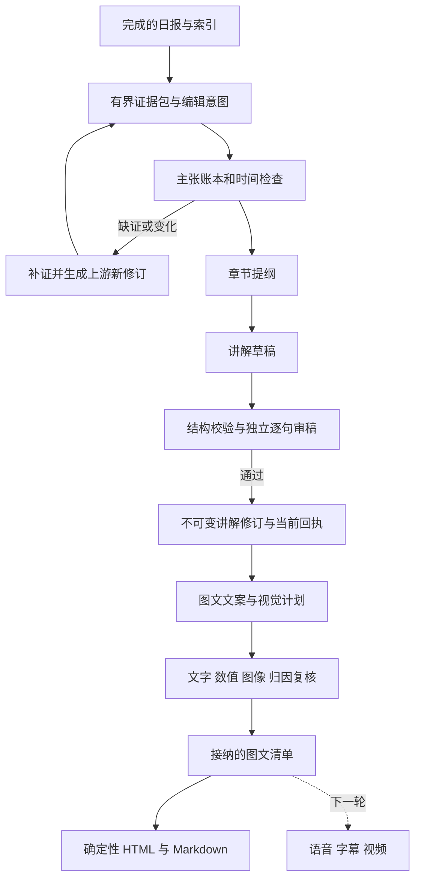

# 新闻讲解稿与图文流：工作流及提示词研究

**状态：** 历史记录（Historical，研究完成时运行时尚未实现）
**负责人：** 仓库维护者
**最后验证：** 2026-09-08
**研究范围：** 为 SignalTrail 选择从新闻材料到讲解稿、再到图文流的实现路线。
**受众：** 有一定背景的中英文读者；讲清来龙去脉，中文可有说书节奏，英文可有小说式叙事，同时保留专业分析（用户已确认）。

[English](../../research/2026-09-08-news-explainer-workflows.md) · [实施路线图](../roadmap.md) · [可试用提示词](../../../templates/news-explainer-prompts.md)

本文保留研究完成时的提案描述。当前实验实现与剩余门禁以[讲解指南](../explainers.md)为准。

## 研究结论

建议增加一个有独立修订与核验状态的“新闻讲解”产物。它从已完成日报的精选证据与分析底稿出发，
先回答读者需要理解的问题，再写自然的讲述，最后编排成按阅读顺序推进的图文。
本轮范围到可阅读、可追溯的 HTML/Markdown 图文流；视频生成属于下一轮。

推荐流程是：**编辑意图 → 证据与时间账本 → 补证或缩小范围 → 章节提纲 → 讲解稿 →
独立事实审稿 → 图文文案与视觉设计 → 图文复核 → 确定性渲染**。
每次新增或改写语义都产生新的待核内容；排版器只使用已接纳的文字、数据和素材。
这是一套针对本仓库的设计建议，尚未经过模型对照实验，不能称为已验证的最优 prompt。

“说书感”宜来自问题、顺序、具体解释和转场。真实报道没有提供的动作、对话、心理活动、
动机与结局，不应由模型补齐。Nieman 的场景写作指南把场景建立在观察、采访记录或影像资料上；
对只有公告和摘要的材料，本项目宜用时间线与机制解释组织叙事。
[Lauren Kessler，Nieman Storyboard，2023-04-20](https://niemanstoryboard.org/2023/04/20/narrative-journalism-reporting-writing-scenes/)

## 当前项目具备什么，还缺什么

以下是对本轮代码、契约和行为测试的核对，优先级高于旧的本地计划。

| 能力 | 当前证据 | 对升级的意义 |
| --- | --- | --- |
| 有界写作包与严格输出结构 | `context.py`、`authoring.py`，`test_authoring.py` 的 Schema、越界证据和一次修复测试 | 可复用设计；新讲解包仍需自己的不可变绑定 |
| 三个专业视角与跨视角综合 | schema 2.0、报告契约、`references/narrative-analysis.md` | 已有分析底稿，不需要把全部简报重新交给讲解作者 |
| 前台叙事、后台论证 | `context.py` 的 `narrative_contract`；主文 4—7 段 | 已有自然研判，但不等于具备完整新闻讲解稿 |
| 新闻时间约束 | `authoring.py` 的新鲜候选选择；报告区分发布时间与采集时间 | 不能替代对生成稿中“今天、已经、首次”等断言的重新核验 |
| 报告发布后的独立评分 | `evaluation.py`、`test_evaluation.py` 的不可变 hash-bound dossier | 评分可借鉴，尚不是讲解稿发布前逐主张放行 |
| 新闻配图与纵向展示 | `media.py`；`test_media.py` 的 HTML/Markdown/Notion 展示测试 | 已有配图展示，尚无按讲解节奏编排的图文语义清单 |
| `verification.py` | 等待网页挑战解除并恢复采集 | 属于访问验证，应另建讲解事实核验职责 |

当前研判证据只允许来自精选事件；schema 2.0 的每个精选事件恰好对应一篇来源文章。
升级不能把多篇相近文章直接塞进现有单事件字段，也不能拿仅存在于普通 briefs 的材料绕过授权。
新证据需经过正常采集、索引、精选与报告修订流程后才能进入讲解包。
具体边界见[报告契约](../../../templates/report-contract.md)和[架构](../ARCHITECTURE.md)。

## 可借鉴的编辑工作流

| 方法与来源 | 适合迁移的部分 | 适用边界 |
| --- | --- | --- |
| [BBC：为广播/播客写新闻](https://downloads.bbc.co.uk/academy/academyfiles/Making%20news%20for%20radio%20or%20a%20podcast.pdf)，BBC Academy，日期未明 | 写给只听一遍的人；短句、日常词、说得出口的数字；写完朗读 | 不能从英文入门教材推出中文最佳句长、语速 |
| [Ros Atkins 新闻讲解讲座](https://reutersinstitute.politics.ox.ac.uk/calendar/art-viral-news-explainer)，Reuters Institute，活动 2022-01-26，Marina Adami 整理 | 开头说明重要性；控制信息密度；仔细设计段落衔接并复核公平性 | 本人强调事实讲解；本项目的专业判断需要另加明确的推断表达，不能声称照搬其方法 |
| [GIJN：把调查写成好故事](https://gijn.org/stories/tips-for-writing-investigative-stories/)，Olga Simanovych，2018-11-19，整理 Ilya Lozovsky 的编辑经验 | 一句话主线、材料取舍、必要身份介绍、清楚路标 | 调查报道的时间顺叙不能机械替代突发新闻的最新变化 |
| [Narrative Podcasts：如何写脚本](https://narrativepodcasts.com/how-do-i-write-a-podcast-script)，机构署名，日期未明 | 起草、编辑、朗读和他人反馈分开；找出走神和拗口的位置 | 创作者教学，兼有课程营销；新闻可以没有人物弧线或结局 |
| [The Pudding：Continue, Pivot, or Put it Down](https://pudding.cool/process/pivot-continue-down/)，Amber Thomas，2020-08 | 先有可回答的问题；用 storyboard 检查信息顺序；证据不支持时换问题或放弃 | 可视化编辑经验，不能证明某种卡片数会提高传播；不采用文中泛化的法律判断 |
| [BBC：为不同平台写作](https://downloads.bbc.co.uk/academy/youngreporter/Lesson%20Plans%20-%20Lesson%20Five%20-%20Transcript%20English.pdf)，BBC Academy，日期未明 | 同一主题分别适配音频、网页和视频；先决定视觉负责解释什么 | 未规定静态图文的页数、尺寸或字数，需本地验证 |

Reuters Institute 的 2024 年用户需求研究也区分“知道更新”与“理解、学习、获得视角”。
这支持把讲解作为独立阅读需求；调查不能替代本项目的中英文读者测试，也不代表中国大陆用户偏好。
[Richard Fletcher，2024-06-17](https://reutersinstitute.politics.ox.ac.uk/digital-news-report/2024/more-just-facts-how-news-audiences-think-about-user-needs)

### 社交媒体提供了什么，以及没有证明什么

公开 Reddit 播客讨论中，有创作者采用完整稿来保持简洁，再练习对话式朗读；也有人使用详细提纲。
原帖则反映完整稿耗时、可能不自然。这些是可核查的经验表达，身份与效果未经独立验证，
不把点赞数当作方法优越性的证据。
[r/podcasting 讨论](https://www.reddit.com/r/podcasting/comments/1dmxgmc/do_you_type_or_write_out_what_you_are_going_to/)
（搜索标注 2024-06-23，打开页为相对日期）。

对 SignalTrail 的推论：为了使事实与修订可追溯，先保存完整讲解稿，再做口语编辑；
将“全稿/提纲”作为表达方式的实验变量，不让即兴补事实进入正式版本。
本轮也搜索了 B 站创作访谈，但未取得足够完整的作者原始方法说明；没有据作品播放量推导成功公式。
尚未对微信、小红书、抖音或 X 的当前分发机制做系统研究。

## 如何把“讲解”加进现有分析

### 同一事实底稿，两种叙事表达

双语不是逐句对译。两种语言共享同一主张与分析底稿，分别组织自然表达，
再逐主张核对实体、数字、时间、归因、因果、情景条件和判断强度。
各自保存语言明确的讲解与图文修订；已有单语报告 Schema 不混入第二种语言。

| 语言 | 建议文风 | 可用的编辑动作 |
| --- | --- | --- |
| 中文 | 有说书节奏的专业讲解 | 用具体问题起势，交代前情，解释关键转折，自然回扣主线；减少播报腔和术语堆叠 |
| 英文 | 带小说叙事连贯性的新闻非虚构 | 使用有据的具体细节、时间推进、段落节奏以及叙事与背景交织；自然引入专业分析 |

“小说式”是表达偏好。有人物/场景材料时可以用，只有公告或数据时也可围绕事件与机制推进，
不强制每章有主人公。英文读稿可有适度句式变化，口播版本再做朗读编辑；
中文不必套“话说、且听下回分解”，英文也不必堆砌修饰或悬念。
这些是用户偏好下的产品建议，尚未证明比其他文风更有效。

叙事与背景交织有新闻写作实践可借鉴。Line Vaaben 描述用素材卡整理场景、背景与事实，
再选择时间顺叙或交织结构，同时保留会影响可信度的反面材料。
本项目借用组织方法，不用抽象主题强行合并无关新闻。
[Nieman Storyboard，2022-02-02](https://niemanstoryboard.org/2022/02/02/sticking-a-story-together-and-nailing-the-structure/)

### 每章要完成的解释

默认栏目名可为“讲解与研判”。一篇章节回答一个中心问题，不把同一天的独立新闻硬串成因果链。
读者看到的顺序可以是：

1. **这一刻变了什么。** 用有时间限定的事实或真实问题开头，不预设惊人反转。
2. **理解它还缺哪段背景。** 解释主体、术语、必要历史与制度/技术条件。
3. **事情如何运作。** 给出可追溯机制；事实关联不自动升级为因果。
4. **据此如何判断。** 接入已有分析，用“这意味着”“如果……那么……”标明推导与条件。
5. **哪里仍不知道。** 处理有证据的最强异议，说明什么新信息会改变判断。
6. **下一步观察什么。** 给读者一个可验证的观察点；进行中的新闻无需强行收尾。

这些是编辑动作，不必变成正文的六个固定小标题。后端仍区分事实、归因陈述、背景、推断、
类比、情景、不确定性和观察信号。类比只用于解释共同机制，同时保留差异；不用于证明预测。
没有反证材料时说“当前材料未覆盖”，不虚构双方各占一半的争论。

建议先做一个章节的工程样稿，随后做完整一期。单章节用于验证文风和证据映射，
不据此宣布完成整期覆盖验收。正式一期仍需在版本化范围规则下覆盖精选事件及三个分析视角，
允许分章节表达不同机制。

## 提示词背后需要哪些检查

| 检查 | 能检查什么 | 必须保留的限制 |
| --- | --- | --- |
| Python 确定性校验 | Schema、证据 ID/位置、哈希、时间解析、单位换算、修订和覆盖集合 | 字段合法不代表来源或语义真实 |
| 作者自查 | 长句、显式矛盾、未解释术语、待核问题 | 没有取证就没有新增事实依据 |
| 独立审稿上下文 | 逐句核对原文支持、归因、限定词、遗漏和因果 | 第二次调用不是第二个独立来源 |
| 外部重新取证 | 更正、撤回、新状态、原始公告、来源谱系 | 搜索摘要与“没搜到”都不足以证明完整事实 |

技术资料支持上述职责划分，但没有证明某一组合在中文日报上必然最优：

- [Anthropic，Building Effective Agents，2024-12-19](https://www.anthropic.com/engineering/building-effective-agents)
  介绍固定 prompt 链和中间程序检查。这里借用可分解的流程原则，不采用旧文的工具选型。
- [Google，Structured outputs，更新 2026-09-02](https://ai.google.dev/gemini-api/docs/structured-output)
  明确要求应用验证字段值并处理 Schema 合规但语义错误的输出。
- [FActScore，Min 等，EMNLP 2023-12](https://aclanthology.org/2023.emnlp-main.741/)
  用原子事实衡量来源支持比例。适合启发逐主张审核；人物传记实验不能直接代表新闻核验效果。
- [CoVe，Dhuliawala 等，2023-09 修订版](https://arxiv.org/html/2309.11495v2)
  拆分核验问题并独立回答；论文承认仍会产生错误，且该研究没有纳入外部工具。
- [Anthropic Citations，日期未明](https://platform.claude.com/docs/en/build-with-claude/citations)
  提供文档位置指针。指针有效、文本支持、来源可信是三个不同判断；后两点仍需检查。
- [Google Search grounding，更新 2026-09-02](https://ai.google.dev/gemini-api/docs/google-search)
  可返回检索与来源关联；开启工具不等于实际搜索，也不能代替独立审稿。

自纠研究也有分歧：[Huang 等，2024-03 修订](https://arxiv.org/html/2310.01798v2)
在所测任务中发现缺少外部反馈的自纠不稳定；[Liu 等，2024-12 修订预印本](https://arxiv.org/html/2406.15673v2)
报告在不同提示和采样设置下可改善结果。任务、模型与方法不同，不能据任何一篇推导
“所有自查都无效”或“温度为零就能确保正确”。本项目采用中性审稿措辞并通过本地样本校准。

## 时效性如何进入工作流

时间判断的对象应是每个主张。网页发布日期、修改日期描述网页本身，不是新闻事件时间。
[Google Search Central，更新 2025-12-10](https://developers.google.com/search/docs/appearance/publication-dates)

以下为拟议字段语义，不是当前已存在的完整 Schema：

| 时间 | 用途与处理 |
| --- | --- |
| `event_at` / 时间区间 | 事实发生时间；允许只有日期或区间，保留精度与来源原文 |
| `published_at` | 来源首次发布；未知保持 null，不以抓取时间补齐 |
| `source_updated_at` | 来源声明的修改时间；不能自动给原事件“续新” |
| `fetched_at`、内容指纹 | 系统何时取得什么内容；可证明观察，不证明新闻刚发生 |
| `as_of`、`timezone` | 本稿知识截止时点与 IANA 时区；“今天/昨日”按它解释 |
| `checked_at`、`valid_until` | 核验执行时点与当前准入期限；由程序签发，不由作者自报 |

保留原始日期字符串、解析依据和时区；不把只有日期的证据伪装成精确到秒。
预定事件的未来日期可以合法存在，但必须写成计划/预期；来源“发布时间在未来”是另一类异常。

建议执行两个时间关口：写稿前核对关键变化，发布或延迟渲染前再检查当前准入。
对突发状态、结果、伤亡统计、价格、发布可用性等易变主张，要求临近发布重新取证；
对历史背景保留其历史标签。旧草案的 120 分钟软有效期只能作为普通新闻的待测上限，
不能证明两小时内不会变化；高变化主题需更短或每次检查，下一版截止窗口仍设硬到期。
这些都是待验证的产品策略，不是行业标准。

重新取证有三种结果：

1. **内容仍一致且关键更新查询已完成：** 保存本次检查范围、来源和时间，按策略产生新回执。
   原 URL 哈希未变只能说明该页未变，不能排除更正被另发在新 URL；应查原发布方更新链。
2. **有新事实、更正或冲突：** 保存取证结果并阻止旧稿作为当前新闻继续输出；
   通过正常流程形成新索引/报告修订，再写新讲解修订。作者不能悄悄扩大旧包。
3. **403、429、挑战、超时或必要来源缺失：** 记录对应访问/检查状态；关键事实时效仍未知，
   不得记作 `no_items`，也不能解释为“没有变化”。

核验既要检查“写错了什么”，也要检查“漏掉了什么”。来源支持率很高的稿件仍可能遗漏
决定性的最新更正。独立审稿应把稿件与编辑意图卡中的必讲事实、关键反证一起比较。

## 建议的数据与执行顺序

主张账本需要保留命题、类型、证据 item 与片段位置、时间范围、适用地域/版本、单位、
归因、依赖主张与证据缺口。模型可以提出候选命题，但 ID、哈希、接纳状态、时间结论由 Python 管理。
“候选主张”还不是已证实事实。

写作完成后，核验者重新找出正文、标题、转场里的全部可核断言，不能只检查作者主动登记的 claim。
“所以”“首次”“已经全面开放”都可能增加新含义。未登记断言必须进入缺陷结果，
不能因为作者标成无事实转场而漏过。

建议初版共享一次修复预算；修复后生成新修订并完整复核。需要新证据时回到上游，
不把它包装成文字润色。阶段可以有多份中间产物，不必每份都增加一个模型调用：
候选抽取和提纲在原型阶段可合并，独立核验保持隔离。

完整阶段提示词见[实验提示词包](../../../templates/news-explainer-prompts.md)。
其中的字段是设计草案；实现时以注入的 `output_schema` 为准，不可提交到现有 analysis 接收器。

## 图文流的具体含义

本轮默认产物是适合桌面与手机顺序阅读的图文长页，另有 Markdown。
它按理解任务组织卡片；以后可由同一清单导出独立图片卡，但本轮不承诺平台模板或自动发布。

| 理解任务 | 建议视觉 | 防止误导的检查 |
| --- | --- | --- |
| 发生了哪些变化 | 标明日期的时间线 | 事件时间与公告时间不能混用 |
| 系统如何运作 | 流程图/关系图 | 箭头不能凭空新增因果关系 |
| 数字意味着什么 | 有单位、基准与时间范围的图表 | 缺失不画成零；不以面积或轴截断夸大差异 |
| 哪些解释有分歧 | 并列观点卡、条件表 | 区分原始说法与本稿推断，不凑虚假对等 |
| 证据还缺什么 | 已知/待核卡 | “未取得”不能写成“不存在” |
| 有关人物或地点是什么 | 有来源和用途记录的新闻图片 | 检查时间、主体、地点、图注与可用权利 |

图像、正文、图注、无障碍替代文字都绑定主张或已接纳片段。
复杂图形还需要简短识别说明与承载关键信息的长描述，不能只给一行“示意图”。
[W3C WAI，Complex Images，更新 2026-04-08](https://www.w3.org/WAI/tutorials/images/complex/)

优先使用项目自己基于已核数据绘制的时间线、流程图和文字卡，以及用途已明确的图片。
当前下载器通过 URL 安全检查，不代表素材已经得到任何发布用途的授权；未知权利时使用文字或自制图表。
装饰图不是必需项，AI 拟真画面不能作为新闻现场证据。AP 的公开准则对生成内容和拟真图像更严格，
本项目借鉴真实性边界，不声称整个生成工作流符合 AP 的编辑政策。
[Nicole Meir，AP，2023-08-15](https://www.ap.org/the-definitive-source/behind-the-news/standards-around-generative-ai/)

卡片压缩最容易丢掉“计划、声称、部分地区、在某测试下”等限定。
初版可直接引用已核段落和标题；若模型为卡片另写短文、图注或标签，它们须经过新语义复核后再接纳。
渲染器只能排版接纳后的 manifest，不能现场调用模型“润色”。

## 一组可追溯的历史样稿

下面是编辑示范，不是本日新闻，也不是已经通过 SignalTrail 自动核验的产物。
本轮读取的是现存网页，没有取得各历史时刻的存档快照；因此不能把例子声称为严格的历史回放。

NASA 的两则报道可以说明“成功接近太阳”“传回状态”“科学数据传回”是不同命题：

- [Mara Johnson-Groh，2024-12-27 报道，页面更新 2025-01-02](https://science.nasa.gov/science-research/heliophysics/nasas-parker-solar-probe-makes-history-with-closest-pass-to-sun/)：
  飞越发生于 12 月 24 日，12 月 26 日晚收到安全信号；文中描述了近日探测的科学用途。
- [Michael Buckley / Johns Hopkins APL，NASA 2025-01-02 报道，页面更新 2025-03-21](https://science.nasa.gov/blogs/parker-solar-probe/2025/01/02/nasas-parker-solar-probe-reports-healthy-status-after-solar-encounter/)：
  1 月 1 日开始收到更详细的遥测，显示仪器在飞越时工作；报道当时把科学数据传输安排在该月稍后。

两者属于同一任务的官方信息链，不能算作两份独立验证。下列 C1—C5 是示范标签，并非运行时 ID。

| 标签 | 命题及性质 | 支持 |
| --- | --- | --- |
| C1 | 2024-12-24 完成此次近日飞越；历史事实 | 12-27 报道 |
| C2 | 12-26 晚收到安全信号；历史事实 | 两则报道 |
| C3 | 1-1 起收到详细状态遥测，支持仪器在飞越期间工作；归因于任务团队 | 1-2 报道 |
| C4 | 1-2 报道计划当月稍后传输科学数据；当时计划 | 1-2 报道 |
| C5 | 接近太阳可支持研究日冕加热与太阳风；任务目标，不等于该次已解决这些问题 | 12-27 报道 |

**讲解稿示范：**

帕克探测器这次飞越，要分清三件事：它完成了接近太阳的飞行，地面确认了它的状态，
科学数据还要按计划传回。这三件事的消息，出现在不同时间。

先看时间顺序。飞越发生在 2024 年 12 月 24 日。两天后，地面收到安全信号。
NASA 在随后 1 月 2 日的报道中又说明，团队已开始收到更详细的遥测，确认仪器在飞越期间工作。

这里容易误读的是“数据”两个字。确认设备状态的遥测，与这次探测取得的科学数据，需要区分。
按照 1 月 2 日报道的安排，科学数据将在当月稍后开始传输。

这项任务让探测器靠近太阳，帮助研究日冕和太阳风。可以据此讲清它为什么值得关注，
但不能把“有机会取得新观测”提前写成“已经破解太阳的奥秘”。

**对应图文节拍：**

| 卡片 | 核心文案 | 视觉任务与主张 |
| --- | --- | --- |
| 1 | 一次飞越，几次不同的信息确认 | 章节导语；C1—C4 |
| 2 | 飞越 → 安全信号 → 详细遥测 | 注明年份与各日期的时间线；C1—C3；箭头表示时间顺序 |
| 3 | 状态遥测与科学数据要分清 | 双栏文字图；C3—C4；保留“当时计划” |
| 4 | 接近太阳，是为了取得新的观测 | 任务目标卡；C5；不宣称问题已解决 |

英文可以改变节奏而保留同一事实范围，例如这一小段：

> The encounter came first; the confirmation followed. Parker passed close to the Sun on
> December 24, 2024. Two days later, a signal told the team it was safe. More detailed telemetry
> began arriving on January 1. The distinction mattered: a report on the spacecraft's condition
> was not the same as the return of its scientific measurements. In the January 2 bulletin,
> that transmission was still scheduled for later in the month.

这是本次编写的英文节选，不是来源引文；复用 C1—C4，展示叙事节奏，不构成完整双语发布样例。

示范需要拦截的改写包括：“2025 年 1 月 2 日才飞越太阳”“全部科学数据已传回”
以及“今天首次破解了太阳风”。前者混淆公告与事件时间，后两者超出证据。
在后来一期里继续写“只收到安全信号”，也应检查是否遗漏了 1 月 2 日的后续状态。

## 如何验证方案有效

采用相同父报告、相同证据截止时间、相同模型设置比较三种版本：现有研判直接朗读、
单次讲解 prompt、分阶段写作与独立核验。先冻结评判规则再看结果，不能只看风格偏好。

| 维度 | 记录方式 |
| --- | --- |
| 事实精度 | 最终文本中获支持的可核主张 / 全部可核主张；单列关键错误 |
| 主张登记完整性 | 独立从成稿发现的主张是否全部有登记，不只检查作者提供的列表 |
| 必讲信息覆盖 | 已核验且纳入的必讲事实 / 编辑意图卡规定的必讲事实 |
| 时效正确性 | 当前表述的证据支持、遗漏更正、跨时区与未来计划错误分别计数 |
| 图文一致性 | 每个标题、图注、数字、图形关系均能回查已核语义 |
| 双语一致性 | 逐主张对照实体、数值、时间、归因、条件与判断强度；两种语言分别检查可读性 |
| 理解与口语 | 人工朗读记录；读者能否复述变化、背景、机制、边界和观察点 |
| 成本与恢复 | 分阶段 Token、调用、用时、修复次数、未知用量、中断与重放结果 |

回归集可沿用旧草案的 32 例候选划分：8 个事实/证据、8 个时间、8 个推断/因果、
4 个注入/越权、4 个正确对照。关键错误全部识别、正确稿不被强行改错，可作为冻结前的目标；
小样本全过不能证明生产误差为零。独立人工标注还应检查重要遗漏与争议案例。
发布门槛与三期真实验收统一放在[路线图](../roadmap.md)。

## 研究限制与停止理由

检索于 2026-09-08 完成，包含新闻机构指南、第一手工程博客、原始论文、创作者博客、公开社媒。
经过发现、定向阅读全文、反例与日期补查后，工作流各关键结论已有一手依据或明确限制；
继续泛搜同类教程不太可能改变实现顺序，因此停止扩展。

访问限制已保留：NPR 教程直接读取受 robots 限制；Poynter 图文互补文章在搜索中可见，
直接打开遇到 403，未用作本方案的必要依据；Reuters 讲座采用主办方文字记录，未声称看完嵌入视频。
B 站方法证据不足。未知发表日期没有从 URL、版权年或搜索抓取时间猜补。

用户确认双语受众后，补查了英文新闻非虚构的叙事/背景交织方法，并增加双语提示词与一致性检查。
研究没有测量中英文最佳篇幅、阅读完成率、真实朗读时长或模型组合效果；
也没有证明某个 prompt 能稳定提升传播量。建议的长度、修复预算、有效期和验收阈值都是产品候选，
必须通过本地原型与真实日报校准。此次只交付研究、提示词和实施计划，运行时能力仍待开发。
