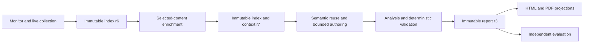

# 2026-08-05 Morning Report Regeneration

**Purpose:** Record the accepted report, artifact lineage, durable engineering decisions,
remaining risks, and verification evidence from the 2026-08-05 morning-edition regeneration.

**Status:** Verified
**Owner:** Repository maintainers
**Last verified:** 2026-08-05

Chinese mirror:
[2026-08-05 早报重生成记录](../zh-CN/exec-plans/completed-2026-08-05-morning-report-regeneration.md).

## Outcome

The authoritative result is `daily-2026-08-05-morning-r3`. It contains 403 ordinary briefs from
29 represented sources, seven non-empty sections, and eight featured events. Its final evidence
index contains 709 items from 32 configured sources.

The run status is `completed_partial`. All 403 planned briefs are present. The partial status
preserves four acquisition outcomes: SEC EDGAR and Reuters require verification, Defence Blog
returned ten candidates before an HTTP 403 and is `partial`, and Yahoo is `rate_limited` after an
HTTP 429. The main run took 2,226 seconds and remained within its 3,600-second budget.

Ordinary briefs follow the current index and `brief_plan.default_item_ids` order. TWZ and InfoQ
rendered continuous `来源Top1`–`来源Top15` labels, while Weibo rendered
`热搜Top1`–`热搜Top15`. Internal importance scores did not reorder ordinary source groups.

The corrected independent evaluation scored the report 36/45. Its continuity decision is
`selective`, excluding `analyses` and `event_summaries` from semantic reuse until the recorded
evidence and TL;DR findings are addressed. The report remains the accepted historical artifact.

## Evidence Boundary

This record uses three evidence classes:

- **Observed:** immutable index, context, authoring receipt, report, run manifest, evaluation,
  projection, and filesystem metadata.
- **Recomputed:** counts, rank sequences, item-ID equality, checksums, and section totals derived
  from those artifacts.
- **Reviewed:** canonical source behavior and its focused regression coverage.

Canonical implementation authority is [src/daily_intelligence](../../src/daily_intelligence/).
Generated and installed copies were excluded from the review boundary.

## Artifact Lineage

Paths in this table are relative to the bound runtime data root.

| Role | Relative path | Meaning |
| --- | --- | --- |
| Run manifest | `runs/2026-08-05/morning.json` | Attempt, state, deadlines, source outcomes, and artifact references |
| Collection index r6 | `indexes/2026-08-05/morning-r6.json` | Collection result before selected-content enrichment |
| Final index r7 | `indexes/2026-08-05/morning-r7.json` | Final 709-item evidence index derived from r6 |
| Final context r7 | `context/2026-08-05/morning-r7.json` | Compact candidates, source plans, reuse decisions, and authoring work |
| Authoring session | `context/2026-08-05/morning-r7-authoring/session.json` | Attempt, context hash, deadline, and accepted receipt |
| Analysis packet | `context/2026-08-05/morning-r7-authoring/analysis-packet.json` | Bounded 18-candidate analysis input |
| Analysis draft | `context/2026-08-05/morning-r7-authoring/analysis-draft.json` | Accepted eight-event analysis output |
| Report JSON | `reports/2026-08-05/morning-r3.json` | Authoritative report |
| Report Markdown | `reports/2026-08-05/morning-r3.md` | Text projection |
| Report HTML | `reports/2026-08-05/morning-r3.html` | Interactive projection |
| Report PDF | `reports/2026-08-05/morning-r3.pdf` | Portable projection |
| Independent evaluation | `evaluations/2026-08-05/morning-r3.json` | Evaluation bound to the report ID and content hash |

The desktop HTML was a convenience copy of the versioned report HTML. Index root `items[]` is the
canonical item view; `sources[].items[]` is its compatibility mirror. Both r7 views contain 709
items and reconcile by item ID.

## Observed Pipeline

| Stage | Accepted observation |
| --- | --- |
| Collection | 32 configured sources; 28 `success`, 2 `verification_required`, 1 `partial`, 1 `rate_limited`; 709 candidates |
| Monitor boundary | Zero `retained_from_previous_snapshot` rows entered the final root index |
| Context | 565 compact candidates, 29 source plans, and 403 ordered planned item IDs |
| Enrichment | 12 HTTP attempts, 6 full-text results, 6 explicit verification/no-body outcomes; 2.642 seconds |
| Brief authoring | 386 approved cache reuses, 17 newly written briefs in one accepted packet, and no missing batch |
| Analysis | 18-candidate packet, 8 featured events, three analysis domains, and 0 validation errors or warnings |
| Media | 139 attached images backed by 123 unique files; 7 safe image omissions; 26,000,222 materialized bytes |
| Delivery | JSON, Markdown, HTML, desktop HTML, and archive index completed before the deferred PDF tail |
| PDF | 155 pages, 98,974,490 bytes; the original optimization gap was retained in technical debt |
| Evaluation | `evaluation-daily-2026-08-05-morning-r3-r3`, 36/45, continuity `selective` |

The report status distribution is 119 `NEW`, 16 `UPD`, and 268 `WATCH`. Its access distribution
is 391 `metadata_only`, 6 `full_text`, and 6 `verification_required`.

| Section | Briefs |
| --- | ---: |
| International | 45 |
| Domestic news | 15 |
| Military | 70 |
| Markets | 76 |
| Technology news | 45 |
| Papers worth reading | 137 |
| Open-source projects | 15 |
| **Total** | **403** |

## Durable Decisions

- Retained monitor history supports continuity and remains outside formal source targets.
- Successful live acquisition owns the ranking prefix; deduplicated monitor rows may supply tail
  fallback. Eligible monitor rows may supply the source when live acquisition yields no candidates.
- `source` order preserves the source's current rank. `published_at` orders parseable timestamps
  descending and keeps stable input order for missing or tied timestamps. Both modes retain the
  original `source_rank` label.
- Report assembly reconstructs each source from its ordered plan. Packet completion order has no
  effect on reader order.
- Retry collection replaces a source at its original position.
- Draft validation uses a validation-only identity on an in-memory copy, leaving the input draft
  unchanged.
- Enrichment creates a derived immutable index and context; predecessor artifacts remain intact.
- Scheduled evaluation is bound to canonical source and the canonical contract through a
  shell-neutral launcher. Installed release copies do not determine evaluation semantics.
- Evaluation findings restrict future semantic reuse without changing the saved report revision.

## Remaining Risks at Closeout

The durable backlog is maintained in the
[technical-debt tracker](tech-debt-tracker.md). At this run's closeout, the principal open areas
were checkpointed enrichment recovery, immutable packet binding, a shared JSON/Markdown revision
transaction, stronger multi-page merge characterization, strict packet sizing, PDF image
optimization, and machine validation of inline evidence continuity.

## Verifiable Artifacts

| Artifact | Bytes | SHA-256 |
| --- | ---: | --- |
| Report JSON r3 | 735,242 | `f9ce3a794fbaf8012ea09774264aff062184ddcbf7b598265d12408da3ed5e87` |
| Report Markdown r3 | 252,164 | `5ee7f53506141e3b3a47d01eb7f7bc809585174d6f592d0237c3e9bea6770210` |
| Report HTML r3 | 542,936 | `cd7c658730562454a0172d99eb86acec53fff1cf4e2312bc7eee971936258f9b` |
| Report PDF r3 | 98,974,490 | `8e6e10d286d241d59338d5bbda902e176d0c00eefffd7d6fe99a9e19710a637a` |
| Independent evaluation r3 | 5,500 | `43ce71a98b333d5d0ac1515ad847c812681790bfa6d000df7a828add97e376b6` |
| Final index r7 | 2,547,312 | `846f5b764ea859de1e22a5ee29a7ba86e1ab9180ee3244a5b0ff4b91e42a7bd9` |
| Final context r7 | 1,215,194 | `00273c941f49c7260da29584a14b946050d2e54ec1eec4db4c92258542a0980e` |

Recomputation confirmed all 29 report-source sequences against their plans, continuous Top labels
for TWZ, Weibo, and InfoQ, zero report-validation errors, zero warnings, and
`deadline_exceeded=false`. The repository gate at closeout passed 236 tests together with lint,
compilation, code-comment, documentation, and whitespace checks.

## Recovery Record

The retained final chain consists of report r3, indexes r6/r7, context r7, the authoring receipt,
the run manifest, and the corrected evaluation. Invalid user-facing revisions r1/r2 and stale
evaluation attempts were quarantined outside the report archive; the archive exposes only morning
r3 for 2026-08-05. Reader projections can be regenerated from report r3 JSON and canonical source
without changing semantic report content.
