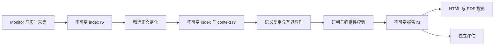

# 2026-08-05 早报重生成记录

**目的：** 记录 2026-08-05 早报重生成的验收结果、工件血缘、持久工程决策、剩余风险与
验证证据。

**状态：** 已验证
**负责人：** 仓库维护者
**最后验证：** 2026-08-05

英文权威版本：
[2026-08-05 Morning Report Regeneration](../../exec-plans/completed-2026-08-05-morning-report-regeneration.md)。

## 结果

权威成品是 `daily-2026-08-05-morning-r3`，包含 403 条普通简报、29 个有内容来源、7 个
非空栏目和 8 个精选事件。最终证据索引覆盖 32 个配置来源，共 709 条候选。

运行状态为 `completed_partial`，403 条计划简报均已交付。该状态保留了四项来源结果：SEC
EDGAR 与 Reuters 需要验证；Defence Blog 返回 10 条候选后遇到 HTTP 403，状态为 `partial`；
Yahoo 遇到 HTTP 429，状态为 `rate_limited`。主运行耗时 2,226 秒，未超过 3,600 秒预算。

普通简报遵循当前 index 与 `brief_plan.default_item_ids` 的顺序。TWZ 与 InfoQ 的标签连续为
`来源Top1`—`来源Top15`，微博连续为 `热搜Top1`—`热搜Top15`。内部重要性分数没有改变
普通来源组的顺序。

纠正后的独立评估为 36/45，连续性决策为 `selective`。在相关证据与 TL;DR 问题解决前，
`analyses` 与 `event_summaries` 不进入语义复用。该日报继续作为本次运行的已验收历史工件。

## 证据边界

本记录使用三类证据：

- **实测：** 不可变 index、context、写作回执、报告、run manifest、评估、投影和文件元数据。
- **复算：** 从上述工件得出的数量、排序、item ID 相等性、校验和与栏目合计。
- **审阅：** 规范源码行为及其聚焦回归覆盖。

规范实现位于 [src/daily_intelligence](../../../src/daily_intelligence/)。生成副本和安装副本未进入
代码审阅的事实源边界。

## 工件血缘

下表路径均相对于运行时绑定的数据根。

| 角色 | 相对路径 | 含义 |
| --- | --- | --- |
| Run manifest | `runs/2026-08-05/morning.json` | Attempt、状态、截止时间、来源结果和工件引用 |
| 采集 index r6 | `indexes/2026-08-05/morning-r6.json` | 正文富化前的采集结果 |
| 最终 index r7 | `indexes/2026-08-05/morning-r7.json` | 从 r6 派生的 709 条最终证据 |
| 最终 context r7 | `context/2026-08-05/morning-r7.json` | 紧凑候选、来源计划、复用决策和写作任务 |
| 写作 session | `context/2026-08-05/morning-r7-authoring/session.json` | Attempt、context Hash、截止时间和接受回执 |
| 研判包 | `context/2026-08-05/morning-r7-authoring/analysis-packet.json` | 18 个候选的有界研判输入 |
| 研判草稿 | `context/2026-08-05/morning-r7-authoring/analysis-draft.json` | 已接受的 8 事件研判结果 |
| 报告 JSON | `reports/2026-08-05/morning-r3.json` | 权威报告 |
| 报告 Markdown | `reports/2026-08-05/morning-r3.md` | 文本投影 |
| 报告 HTML | `reports/2026-08-05/morning-r3.html` | 交互投影 |
| 报告 PDF | `reports/2026-08-05/morning-r3.pdf` | 便携投影 |
| 独立评估 | `evaluations/2026-08-05/morning-r3.json` | 与报告 ID 和内容 Hash 绑定的评估 |

桌面 HTML 是版本化报告 HTML 的便捷副本。Index 根级 `items[]` 是规范条目视图，
`sources[].items[]` 是兼容镜像。r7 的两个视图均含 709 条，并可按 item ID 完全对账。

## 实测流水线

| 阶段 | 已验收实测结果 |
| --- | --- |
| 采集 | 32 个配置来源；28 个 `success`、2 个 `verification_required`、1 个 `partial`、1 个 `rate_limited`；709 条候选 |
| Monitor 边界 | 最终根级 index 中 `retained_from_previous_snapshot` 条目为 0 |
| Context | 565 个紧凑候选、29 个来源计划、403 个有序计划 item ID |
| 正文富化 | 12 次 HTTP 尝试，6 条全文，6 条显式验证/无正文结果；耗时 2.642 秒 |
| Brief 写作 | 386 条已批准缓存复用、17 条新写、1 个接受 Packet、无缺失批次 |
| 研判 | 18 候选、8 精选事件、3 个研判领域，校验为 0 错误、0 警告 |
| 媒体 | 附加 139 张图片，对应 123 个唯一文件；7 个安全省略；物化 26,000,222 字节 |
| 交付 | JSON、Markdown、HTML、桌面 HTML 与归档索引在延迟 PDF 尾任务前完成 |
| PDF | 155 页、98,974,490 字节；当时的图片优化缺口已写入技术债 |
| 评估 | `evaluation-daily-2026-08-05-morning-r3-r3`，36/45，连续性为 `selective` |

报告状态分布为 119 条 `NEW`、16 条 `UPD`、268 条 `WATCH`；访问分布为 391 条
`metadata_only`、6 条 `full_text`、6 条 `verification_required`。

| 栏目 | 条数 |
| --- | ---: |
| 国际 | 45 |
| 国内新闻 | 15 |
| 军事 | 70 |
| 市场 | 76 |
| 技术新闻 | 45 |
| 值得阅读的论文 | 137 |
| 今日值得关注的开源项目 | 15 |
| **合计** | **403** |

## 持久决策

- Monitor 历史条目用于连续性，不计入正式来源目标。
- 实时采集成功时，其结果占据排序前缀，去重后的 Monitor 条目可以补尾；实时采集没有候选时，
  合格 Monitor 条目可以作为来源结果。
- `source` 顺序保留来源当前排名；`published_at` 按有效发布时间倒序，缺失或并列时间保持稳定
  输入顺序。两种模式都保留原始 `source_rank` 标签。
- 报告按照各来源的有序计划重建，Packet 完成顺序不影响读者看到的顺序。
- 重试采集在来源原位置替换结果。
- 草稿校验在内存副本中使用仅供校验的身份，不修改输入草稿。
- 正文富化创建派生的不可变 index 与 context，前序工件保持完整。
- 调度评估通过 shell 无关的启动方式绑定规范源码与权威契约，安装副本不决定评估语义。
- 评估结论可以限制后续语义复用，但不改变已保存的报告 Revision。

## 收尾时的剩余风险

持久事项统一记录在[技术债追踪器](tech-debt-tracker.md)。本次运行收尾时，主要开放领域包括：
正文富化的检查点恢复、不可变 Packet 绑定、JSON/Markdown 共享 Revision 事务、多页合并刻画、
严格 Packet 大小、PDF 图片优化，以及正文证据连续性的机器校验。

## 可复核工件

| 工件 | 字节 | SHA-256 |
| --- | ---: | --- |
| 报告 JSON r3 | 735,242 | `f9ce3a794fbaf8012ea09774264aff062184ddcbf7b598265d12408da3ed5e87` |
| 报告 Markdown r3 | 252,164 | `5ee7f53506141e3b3a47d01eb7f7bc809585174d6f592d0237c3e9bea6770210` |
| 报告 HTML r3 | 542,936 | `cd7c658730562454a0172d99eb86acec53fff1cf4e2312bc7eee971936258f9b` |
| 报告 PDF r3 | 98,974,490 | `8e6e10d286d241d59338d5bbda902e176d0c00eefffd7d6fe99a9e19710a637a` |
| 独立评估 r3 | 5,500 | `43ce71a98b333d5d0ac1515ad847c812681790bfa6d000df7a828add97e376b6` |
| 最终 index r7 | 2,547,312 | `846f5b764ea859de1e22a5ee29a7ba86e1ab9180ee3244a5b0ff4b91e42a7bd9` |
| 最终 context r7 | 1,215,194 | `00273c941f49c7260da29584a14b946050d2e54ec1eec4db4c92258542a0980e` |

复算确认 29 个报告来源的条目顺序均与计划一致，TWZ、微博和 InfoQ 的 Top 标签连续，报告
校验为 0 错误、0 警告，且 `deadline_exceeded=false`。收尾时仓库门禁通过 236 项测试，并通过
静态检查、编译、代码注释、文档和空白检查。

## 恢复记录

最终保留链由报告 r3、index r6/r7、context r7、写作回执、run manifest 与纠正后的评估组成。
无效的用户可见 r1/r2 和旧评估尝试已隔离到报告归档之外；2026-08-05 的归档入口只展示早报
r3。阅读投影可以从报告 r3 JSON 和规范源码重建，报告语义内容保持不变。
